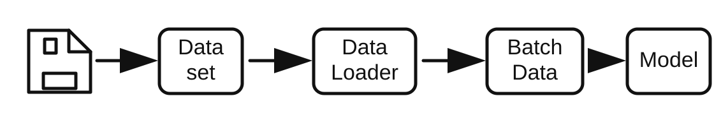

# DataLoader

## DataLoader 的功能

在 PyTorch 的数据模块中，`Dataset` 负责定义“一个样本怎么读取”，`DataLoader` 负责定义“多个样本怎么被取出、组合成 batch，并送入模型”。



可以把整个流程理解为：

```text
磁盘数据 -> Dataset 读取单个样本 -> DataLoader 组织 batch -> Batch Data -> Model
```

第一篇笔记已经说明了 `Dataset.__getitem__` 如何根据索引读取一个样本。到了 `DataLoader` 这一层，重点变成：

- 一次取多少个样本，也就是 `batch_size`。
- 是否打乱样本顺序，也就是 `shuffle`。
- 是否用特殊采样策略，也就是 `sampler`。
- 如何把多个样本合并成 batch，也就是 `collate_fn`。
- 是否用多进程并行读取，也就是 `num_workers`。
- 最后一个 batch 不够完整时是否丢弃，也就是 `drop_last`。

训练代码中常见的写法如下：

```python
from torch.utils.data import DataLoader

train_loader = DataLoader(
    dataset=train_set,
    batch_size=32,
    shuffle=True,
)

for inputs, targets in train_loader:
    outputs = model(inputs)
```

这里 `for inputs, targets in train_loader` 每次拿到的已经不是单个样本，而是一个 batch。

## DataLoader 参数列表

`DataLoader` 的常见参数签名如下：

```python
DataLoader(
    dataset,
    batch_size=1,
    shuffle=None,
    sampler=None,
    batch_sampler=None,
    num_workers=0,
    collate_fn=None,
    pin_memory=False,
    drop_last=False,
    timeout=0,
    worker_init_fn=None,
    multiprocessing_context=None,
    generator=None,
    *,
    prefetch_factor=None,
    persistent_workers=False,
    pin_memory_device="",
    in_order=True,
)
```

其中最常修改的是下面这些：

| 参数 | 作用 | 常见用法 |
| --- | --- | --- |
| `dataset` | 指定要读取的数据集 | 传入自定义 `Dataset`、`ImageFolder` 等 |
| `batch_size` | 每个 batch 的样本数 | 训练常用 `16`、`32`、`64` 等 |
| `shuffle` | 每个 epoch 是否打乱样本顺序 | 训练集通常 `True`，验证集通常 `False` |
| `sampler` | 自定义单个样本的采样顺序 | 类别不均衡时可用 `WeightedRandomSampler` |
| `num_workers` | 用几个子进程读取数据 | `0` 表示主进程读取，较大数据集可设为 `2`、`4`、`8` |
| `collate_fn` | 控制多个样本如何合并成 batch | 样本长度不一致时常需要自定义 |
| `pin_memory` | 是否把 Tensor 放到页锁定内存 | 使用 GPU 训练时可尝试设为 `True` |
| `drop_last` | 是否丢弃最后不足一个 batch 的数据 | BatchNorm 或固定 batch 训练时可能设为 `True` |

进阶参数通常先知道含义即可：

| 参数 | 作用 |
| --- | --- |
| `batch_sampler` | 直接产生一组 batch 索引，和 `batch_size`、`shuffle`、`sampler`、`drop_last` 互斥 |
| `timeout` | worker 读取一个 batch 的超时时间 |
| `worker_init_fn` | 每个 worker 启动时执行的初始化函数 |
| `multiprocessing_context` | 指定多进程启动上下文 |
| `generator` | 控制随机采样或打乱顺序时使用的随机数生成器 |
| `prefetch_factor` | 每个 worker 预取的 batch 数量 |
| `persistent_workers` | 一个 epoch 结束后是否保留 worker，减少重复启动开销 |
| `pin_memory_device` | 指定 pin memory 的设备，实际使用中较少手动设置 |
| `in_order` | 多 worker 时是否按先进先出的顺序返回 batch |

## 映射式与迭代式 Dataset

PyTorch 中的 Dataset 有两种主要形式：映射式（Map-style）和迭代式（Iterable-style）。

### 映射式 Dataset

映射式 Dataset 是最常见的形式，核心是实现 `__getitem__` 和 `__len__`：

```python
from torch.utils.data import Dataset


class MyDataset(Dataset):
    def __getitem__(self, index):
        return self.data[index]

    def __len__(self):
        return len(self.data)
```

这种 Dataset 像一个可以按下标访问的列表：

```python
dataset[0]
dataset[10]
dataset[100]
```

前一篇中的自定义图片 Dataset、`ImageFolder`、`csv`、`txt`、`.npz` 都属于映射式 Dataset。常规图像分类、表格数据、已经整理好的数组数据，大多都使用映射式 Dataset。

### 迭代式 Dataset

迭代式 Dataset 继承 `IterableDataset`，核心是实现 `__iter__`：

```python
from torch.utils.data import IterableDataset


class LogDataset(IterableDataset):
    def __iter__(self):
        with open("train.log") as f:
            for line in f:
                yield parse_line(line)
```

这种 Dataset 更像数据流：数据一条一条产出，不强调 `dataset[index]`。它适合日志流、在线数据、数据库流式读取、超大文件逐行读取等场景。

### 两者对比

| 对比点 | 映射式 Map-style | 迭代式 Iterable-style |
| --- | --- | --- |
| 核心方法 | `__getitem__`、`__len__` | `__iter__` |
| 访问方式 | 通过索引访问 | 顺序迭代读取 |
| 是否通常知道长度 | 通常知道 | 可以不知道 |
| 是否支持随机索引 | 支持 | 通常不支持 |
| 是否适合 `shuffle` | 适合 | 不天然适合 |
| 是否适合 `sampler` | 适合 | 通常不用 `sampler` |
| 典型场景 | 图像分类、`ImageFolder`、`csv`、`.npz` | 流式日志、在线数据、超大文件 |

入门和常规训练中，主流是映射式 Dataset。后续示例也以映射式 Dataset 为主。

## batch_size、shuffle 与 drop_last

下面使用蚂蚁蜜蜂二分类数据集说明 `batch_size`、`shuffle`、`drop_last` 的作用。假设 `train_set` 中共有 5 个样本，图像经过如下预处理：

```python
from torchvision import transforms

normalize = transforms.Normalize(
    [0.485, 0.456, 0.406],
    [0.229, 0.224, 0.225],
)
transforms_train = transforms.Compose([
    transforms.Resize((224, 224)),
    transforms.ToTensor(),
    normalize,
])
```

单张 RGB 图片经过 `ToTensor()` 后形状为 `[3, 224, 224]`。多个样本被 `DataLoader` 合并后，形状会变成 `[B, 3, 224, 224]`，其中 `B` 是当前 batch 的样本数。

### 示例代码

```python
from torch.utils.data import DataLoader


train_loader_bs2 = DataLoader(dataset=train_set, batch_size=2, shuffle=True)
train_loader_bs3 = DataLoader(dataset=train_set, batch_size=3, shuffle=True)
train_loader_bs2_drop = DataLoader(dataset=train_set, batch_size=2, shuffle=True, drop_last=True)

for i, (inputs, target) in enumerate(train_loader_bs2):
    print(i, inputs.shape, target.shape, target)

for i, (inputs, target) in enumerate(train_loader_bs3):
    print(i, inputs.shape, target.shape, target)

for i, (inputs, target) in enumerate(train_loader_bs2_drop):
    print(i, inputs.shape, target.shape, target)
```

### 运行结果

```text
# batch_size=2, shuffle=True
0 torch.Size([2, 3, 224, 224]) torch.Size([2]) tensor([1, 0])
1 torch.Size([2, 3, 224, 224]) torch.Size([2]) tensor([0, 1])
2 torch.Size([1, 3, 224, 224]) torch.Size([1]) tensor([0])

# batch_size=3, shuffle=True
0 torch.Size([3, 3, 224, 224]) torch.Size([3]) tensor([0, 0, 1])
1 torch.Size([2, 3, 224, 224]) torch.Size([2]) tensor([1, 0])

# batch_size=2, shuffle=True, drop_last=True
0 torch.Size([2, 3, 224, 224]) torch.Size([2]) tensor([0, 0])
1 torch.Size([2, 3, 224, 224]) torch.Size([2]) tensor([0, 1])
```

### 输出解释

- `inputs.shape = [B, C, H, W]`。
- `B` 是当前 batch 的样本数，不一定总等于设置的 `batch_size`。
- `C=3` 表示 RGB 图像有 3 个通道。
- `H=W=224` 来自 `transforms.Resize((224, 224))`。
- `target.shape = [B]`，表示每个样本对应一个类别标签。
- `batch_size=2` 时，5 个样本会分成 `2 + 2 + 1`，最后一个 batch 只有 1 个样本。
- `batch_size=3` 时，5 个样本会分成 `3 + 2`，最后一个 batch 只有 2 个样本。
- `drop_last=True` 时，最后不足一个 batch 的数据会被丢弃，所以 `batch_size=2` 只保留 `2 + 2`。
- `shuffle=True` 会让样本顺序在每个 epoch 打乱，因此标签顺序每次运行可能不同；这里的标签值只用于说明输出格式。

## 常修改参数示例

### num_workers

`num_workers` 控制使用多少个子进程读取数据：

```python
train_loader = DataLoader(
    dataset=train_set,
    batch_size=32,
    shuffle=True,
    num_workers=4,
)
```

当 `num_workers=0` 时，数据读取发生在主进程中。设置为大于 0 后，DataLoader 会用多个 worker 并行读取样本，通常可以缓解图片解码和预处理带来的等待。但它不是越大越好，过大可能带来进程开销、内存占用和磁盘竞争。

### pin_memory

如果使用 GPU 训练，可以尝试打开 `pin_memory`：

```python
import torch


device = torch.device("cuda" if torch.cuda.is_available() else "cpu")

train_loader = DataLoader(
    dataset=train_set,
    batch_size=32,
    shuffle=True,
    num_workers=4,
    pin_memory=True,
)

for inputs, targets in train_loader:
    inputs = inputs.to(device, non_blocking=True)
    targets = targets.to(device, non_blocking=True)
```

`pin_memory=True` 会把 batch 中的 Tensor 放入页锁定内存，通常能让 CPU 到 GPU 的数据拷贝更快。它主要在使用 CUDA 时有意义。

### sampler

`sampler` 用于控制样本索引的产生方式。训练集中类别不均衡时，可以用 `WeightedRandomSampler` 提高少数类被采到的概率。

```python
import torch
from torch.utils.data import DataLoader, WeightedRandomSampler


weights = torch.tensor([1, 5], dtype=torch.float)
train_targets = [sample[1] for sample in train_data.img_info]
samples_weights = weights[train_targets]

sampler_w = WeightedRandomSampler(
    weights=samples_weights,
    num_samples=len(samples_weights),
    replacement=True,
)

train_loader = DataLoader(
    dataset=train_data,
    batch_size=2,
    sampler=sampler_w,
)
```

这里 `weights = [1, 5]` 表示类别 `1` 的采样权重是类别 `0` 的 5 倍。`samples_weights` 是每个样本自己的权重。由于 `replacement=True` 表示有放回采样，同一个样本可能在一个 epoch 中被重复采到。

使用 `sampler` 时不要同时设置 `shuffle=True`，因为二者都在控制采样顺序。

### collate_fn

默认情况下，DataLoader 会使用默认的 `collate_fn`，把多个样本自动堆叠成 batch。例如每个样本返回 `(image, label)`，其中 `image` 是 `[3, 224, 224]`，默认合并后就是：

```text
images: [B, 3, 224, 224]
labels: [B]
```

但如果样本长度不一致，默认堆叠可能失败。例如文本序列长度不同，或者目标检测中每张图的框数量不同，就需要自定义 `collate_fn`。

```python
def detection_collate_fn(batch):
    images, targets = zip(*batch)
    return list(images), list(targets)


train_loader = DataLoader(
    dataset=train_set,
    batch_size=4,
    shuffle=True,
    collate_fn=detection_collate_fn,
)
```

这个函数的输入是一个 batch 的样本列表，输出是整理后的 batch。它不强行把所有内容堆成 Tensor，而是保留为 list，适合不规则结构。

## DataLoader 的内部工作原理

从外部看，DataLoader 只是一个可以被 `for` 循环遍历的对象：

```python
for inputs, targets in train_loader:
    ...
```

内部可以按下面的流程理解：

```text
DataLoader
    -> Sampler 产生单个样本索引
    -> BatchSampler 把多个索引组成一组
    -> Dataset.__getitem__ 根据索引读取样本
    -> collate_fn 把多个样本合并成 batch
    -> 返回给训练循环
```

### 第一步：Sampler 产生索引

对于映射式 Dataset，DataLoader 首先需要决定这一轮按照什么顺序访问样本。

如果没有手动传入 `sampler`：

- `shuffle=False` 时，通常使用顺序采样，索引类似 `[0, 1, 2, 3, ...]`。
- `shuffle=True` 时，通常使用随机采样，索引类似 `[3, 0, 4, 1, 2, ...]`。

所以 `shuffle` 本质上影响的是“索引顺序”，不是改变数据本身。

如果手动传入 `sampler`，例如 `WeightedRandomSampler`，DataLoader 就按照 sampler 产生的索引取样。

### 第二步：BatchSampler 组织 batch 索引

`batch_size` 和 `drop_last` 会影响索引如何被分组。假设数据集长度是 5：

```text
索引顺序: [0, 1, 2, 3, 4]
```

当 `batch_size=2, drop_last=False`：

```text
[0, 1], [2, 3], [4]
```

当 `batch_size=2, drop_last=True`：

```text
[0, 1], [2, 3]
```

因此，最后一个 batch 的大小由 `drop_last` 决定是否保留。

### 第三步：Dataset 读取单样本

对每一组 batch 索引，DataLoader 会调用 Dataset 的取样逻辑。对于映射式 Dataset，可以理解为：

```python
batch_indices = [0, 1]
samples = [dataset[index] for index in batch_indices]
```

如果 `dataset[index]` 返回的是：

```python
(image, label)
```

那么 `samples` 大致就是：

```python
[
    (image_0, label_0),
    (image_1, label_1),
]
```

### 第四步：collate_fn 合并样本

`collate_fn` 负责把上面的样本列表合并成模型需要的 batch。默认规则会把形状相同的 Tensor 沿第 0 维堆叠：

```text
[3, 224, 224] + [3, 224, 224]
-> [2, 3, 224, 224]
```

标签也会从多个整数合并成一个 Tensor：

```text
0, 1 -> tensor([0, 1])
```

这就是为什么训练循环里拿到的是：

```python
inputs.shape == torch.Size([B, 3, 224, 224])
target.shape == torch.Size([B])
```

### 第五步：多进程读取与内存加速

当 `num_workers=0` 时，采样、读取、预处理、合并 batch 都在主进程中完成。

当 `num_workers>0` 时，DataLoader 会启动多个 worker 进程。worker 负责并行执行样本读取和预处理，主进程负责接收整理好的 batch。这样可以减少模型等待数据的时间。

当 `pin_memory=True` 时，DataLoader 会把 Tensor 放入页锁定内存。GPU 训练时，再配合：

```python
inputs = inputs.to(device, non_blocking=True)
```

通常可以让数据从 CPU 拷贝到 GPU 更高效。

## 常见错误

- 同时设置 `shuffle=True` 和 `sampler`：二者都控制采样顺序，通常不能同时使用。
- 误以为每个 batch 的大小都等于 `batch_size`：如果 `drop_last=False`，最后一个 batch 可能更小。
- `num_workers` 设置过大：可能导致内存占用增大、数据读取反而变慢。
- 自定义 `collate_fn` 返回结构不符合训练代码预期：训练循环中的解包方式要和 `collate_fn` 输出一致。
- 使用 GPU 训练时只设置 `pin_memory=True`，但没有使用 `.to(device)`：pin memory 只是加速 CPU 到 GPU 的拷贝，不能自动把数据放到 GPU。
- 迭代式 Dataset 多 worker 读取时没有做数据切分：不同 worker 可能重复读取同一批数据。
