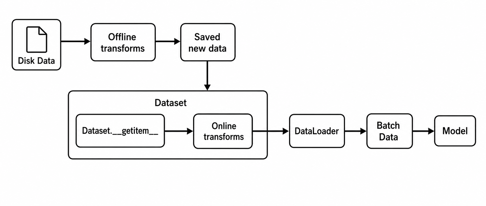
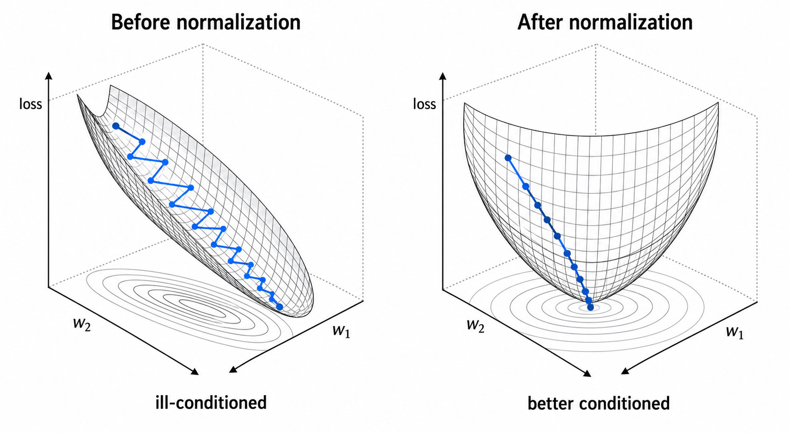

# Transforms

## Transforms 在数据流中的位置

本篇中的 `transforms` 主要指 `torchvision.transforms`，它是 PyTorch 视觉任务中常用的图像预处理与数据增强工具。它通常和 `Dataset` 配合使用，在单个样本被读取出来之后，对图像进行尺寸调整、随机增强、类型转换和标准化。

说明：torchvision 当前文档更推荐使用 `torchvision.transforms.v2`，但本篇为了和教程代码、前两篇笔记保持一致，主要使用经典写法 `from torchvision import transforms`。两者在本篇涉及的核心概念上是一致的：都是把图像预处理和增强操作组织成可调用的变换流程。



从整体数据流看，transforms 有两种常见使用方式：

- 在线 transforms：在 `Dataset.__getitem__` 中执行。每次 DataLoader 取到某个样本索引时，Dataset 读取原始图片，然后立刻执行 transforms，最后返回处理后的样本。
- 离线 transforms：在训练前先用脚本把原始数据预处理或增强成新文件，并保存到磁盘。训练时 Dataset 读取的是已经处理过的新数据。

常规 PyTorch 训练中，最常见的是在线 transforms：

```python
from torch.utils.data import Dataset
from PIL import Image


class ImageDataset(Dataset):
    def __init__(self, root_dir, transform=None):
        self.root_dir = root_dir
        self.transform = transform
        self.img_info = []
        self._get_img_info()

    def __getitem__(self, index):
        path_img, label = self.img_info[index]
        img = Image.open(path_img).convert("RGB")

        if self.transform is not None:
            img = self.transform(img)

        return img, label
```

这里的关键触发点是：

```python
img = self.transform(img)
```

也就是说，`Dataset` 决定“读哪张图”，`transforms` 决定“这张图读出来后怎样处理”，`DataLoader` 决定“怎样把多个样本组成 batch”。

## Transforms 的作用

`transforms` 最重要的作用是数据增强。通过随机裁剪、随机翻转、随机旋转、颜色扰动等操作，可以让模型在训练时看到更多样化的输入，从而缓解过拟合，提高泛化能力。

除了数据增强，它还承担一些基础预处理功能：

- 尺寸统一：把不同大小的图片调整到模型需要的输入尺寸，例如 `224 x 224`。
- 类型转换：把 `PIL Image` 或 `ndarray` 转成 `torch.Tensor`。
- 数值缩放：例如 `ToTensor()` 会把常见 `uint8` 图像从 `0-255` 缩放到 `0-1`。
- 标准化：用 `Normalize(mean, std)` 按通道做归一化处理。
- 训练/验证输入对齐：训练集可以使用随机增强，验证集通常使用确定性预处理，二者最终都要输出模型可接收的 Tensor。

一个典型训练 transform 如下：

```python
from torchvision import transforms


train_transform = transforms.Compose([
    transforms.RandomResizedCrop(224),
    transforms.RandomHorizontalFlip(p=0.5),
    transforms.ToTensor(),
    transforms.Normalize(
        mean=[0.485, 0.456, 0.406],
        std=[0.229, 0.224, 0.225],
    ),
])
```

一般顺序是：

```text
几何变换 / 颜色变换 -> ToTensor -> Normalize
```

`Normalize` 通常放在 `ToTensor` 后面，因为它处理的是 Tensor，而不是原始 PIL 图像。

## 常用 transforms 参数速查

| Transform | 常用参数 | 参数含义 | 常见位置 |
| --- | --- | --- | --- |
| `Compose` | `transforms` | 按顺序执行的一组 transform | 最外层组合 |
| `Resize` | `size` | 输出尺寸或短边尺寸 | `ToTensor` 前 |
| `CenterCrop` | `size` | 从中心裁剪出的尺寸 | 验证集常用 |
| `ToTensor` | 无 | 转 Tensor，并常将 `0-255` 缩放到 `0-1` | `Normalize` 前 |
| `Normalize` | `mean`、`std` | 按通道做标准化 | `ToTensor` 后 |
| `RandomCrop` | `size`、`padding` | 随机裁剪尺寸和裁剪前填充 | 训练集常用 |
| `RandomHorizontalFlip` | `p` | 水平翻转概率 | 训练集常用 |
| `RandomVerticalFlip` | `p` | 垂直翻转概率 | 视任务而定 |
| `RandomRotation` | `degrees` | 随机旋转角度范围 | 训练集可用 |
| `RandomResizedCrop` | `size`、`scale`、`ratio` | 随机裁剪面积、宽高比和输出尺寸 | ImageNet 风格训练 |
| `ColorJitter` | `brightness`、`contrast`、`saturation`、`hue` | 颜色扰动范围 | 训练集可用 |
| `RandomApply` | `transforms`、`p` | 按概率执行一组 transform | 组合增强 |
| `RandomChoice` | `transforms` | 从多个 transform 中随机选一个 | 组合增强 |

## Compose：组合多个变换

`transforms.Compose` 用于把多个 transform 按顺序串起来：

```python
transform = transforms.Compose([
    transforms.Resize((224, 224)),
    transforms.ToTensor(),
    transforms.Normalize([0.5], [0.5]),
])
```

它的运行逻辑可以理解为：

```python
for t in self.transforms:
    img = t(img)
return img
```

所以每一步的输出必须能作为下一步的输入。例如：

```text
PIL Image
    -> Resize
    -> PIL Image
    -> ToTensor
    -> Tensor
    -> Normalize
    -> Tensor
```

如果顺序写错，例如把 `Normalize` 放在 `ToTensor` 前面，就会出现类型不匹配，因为 `Normalize` 需要 Tensor 图像。

## 基础预处理

### Resize

`Resize` 用于调整图像尺寸：

```python
transforms.Resize((224, 224))
```

常见参数是 `size`：

- `size=(h, w)`：直接把图像调整为指定高度和宽度。
- `size=256`：把图像较短边调整为 256，另一边按比例缩放。

示例：

```python
transform = transforms.Compose([
    transforms.Resize((224, 224)),
    transforms.ToTensor(),
])
```

如果模型要求固定输入尺寸，最稳妥的方式通常是直接使用 `(h, w)`，或者使用 `Resize(256) + CenterCrop(224)`。

```python
valid_transform = transforms.Compose([
    transforms.Resize(256),
    transforms.CenterCrop(224),
    transforms.ToTensor(),
])
```

这里 `Resize(256)` 保持比例缩放，`CenterCrop(224)` 再从中心裁剪出固定大小。

### CenterCrop

`CenterCrop` 从图像中心裁剪指定大小：

```python
transforms.CenterCrop(224)
```

常用于验证集或测试集，因为它是确定性的：同一张图每次处理结果相同。

```python
valid_transform = transforms.Compose([
    transforms.Resize(256),
    transforms.CenterCrop(224),
    transforms.ToTensor(),
])
```

### ToTensor

`ToTensor` 把 `PIL Image` 或 `numpy.ndarray` 转换成 Tensor：

```python
transforms.ToTensor()
```

它通常会完成两件事：

- 维度转换：`H x W x C` 变成 `C x H x W`。
- 数值缩放：常见 `uint8` 图像的像素值从 `0-255` 缩放到 `0-1`。

例如一张 RGB 图片经过 `ToTensor()` 后：

```text
PIL Image: H x W x C
Tensor:    C x H x W
范围:      0-255 -> 0-1
```

这一步非常关键，因为 PyTorch 模型通常接收 Tensor，而不是 PIL 图像。

更准确地说，NumPy 中的图像通常是 `numpy.ndarray`，PyTorch 中模型计算使用的是 `torch.Tensor`。二者都能表示多维数组，但定位不同：

| 对比点 | `numpy.ndarray` | `torch.Tensor` |
| --- | --- | --- |
| 所属库 | NumPy | PyTorch |
| 主要用途 | 通用数值计算、图像读取和预处理 | 深度学习训练、模型前向传播、反向传播 |
| 常见图像维度 | `H x W x C` | `C x H x W` |
| GPU 支持 | 默认在 CPU 上 | 支持 CPU / GPU |
| 自动求导 | 不支持 PyTorch autograd | 支持 autograd |
| 是否能直接输入 PyTorch 模型 | 通常不能 | 可以 |

为什么要转成 Tensor？因为 PyTorch 的模型层，例如 `nn.Conv2d`，接收的是 Tensor，并且默认按照 `C x H x W` 或 `B x C x H x W` 的格式理解图像。DataLoader 组 batch 后，模型常见输入形状是：

```text
[B, C, H, W]
```

其中：

- `B`：batch size。
- `C`：通道数。
- `H`：图像高度。
- `W`：图像宽度。

而很多图像读取库得到的是 `H x W x C`。例如：

```python
import numpy as np

img_np = np.zeros((224, 224, 3), dtype=np.uint8)
print(img_np.shape)
```

输出：

```text
(224, 224, 3)
```

这个形状表示：

```text
H=224, W=224, C=3
```

经过 `ToTensor()` 后，会变成：

```text
C=3, H=224, W=224
```

可以用下面的代码直观看到：

```python
from PIL import Image
from torchvision import transforms

img = Image.open("cat.jpg").convert("RGB")
img_tensor = transforms.ToTensor()(img)

print(img_tensor.shape)
print(img_tensor.dtype)
print(img_tensor.min(), img_tensor.max())
```

可能输出：

```text
torch.Size([3, 224, 224])
torch.float32
tensor(0.) tensor(1.)
```

`ToTensor()` 对常见 `uint8` 图像的操作可以通俗理解为两步：

```text
第一步：维度换位
H x W x C -> C x H x W

第二步：数值缩放
pixel_float = pixel_uint8 / 255.0
```

如果原来某个像素的 RGB 值是：

```text
[0, 128, 255]
```

经过缩放后大致变成：

```text
[0 / 255, 128 / 255, 255 / 255]
= [0.0000, 0.5020, 1.0000]
```

手动写一个近似过程如下：

```python
import numpy as np
import torch

# img 是 PIL Image；img_np: H x W x C, uint8, 取值 0-255
img_np = np.array(img)

# 先转成 Tensor，再把维度从 HWC 调整为 CHW
img_tensor = torch.from_numpy(img_np).permute(2, 0, 1)

# 转成 float，并缩放到 0-1
img_tensor = img_tensor.float() / 255.0
```

这段代码表达的是 `ToTensor()` 最核心的思想。实际 `ToTensor()` 还会处理 PIL 图像模式、灰度图、不同输入类型等细节，但学习时可以先抓住两个重点：**维度从 HWC 变 CHW，数值从 0-255 变 0-1**。

### Normalize

`Normalize` 对 Tensor 图像按通道做标准化：

```python
transforms.Normalize(
    mean=[0.485, 0.456, 0.406],
    std=[0.229, 0.224, 0.225],
)
```

计算方式是：

```text
output[channel] = (input[channel] - mean[channel]) / std[channel]
```

参数必须和通道数对应：

- RGB 图像有 3 个通道，`mean` 和 `std` 通常各有 3 个值。
- 灰度图有 1 个通道，`mean` 和 `std` 通常各有 1 个值。

灰度图示例：

```python
transforms.Normalize(mean=[0.5], std=[0.5])
```

RGB 图像示例：

```python
transforms.Normalize(
    mean=[0.485, 0.456, 0.406],
    std=[0.229, 0.224, 0.225],
)
```

`Normalize` 应放在 `ToTensor` 后面：

```python
transforms.Compose([
    transforms.Resize((224, 224)),
    transforms.ToTensor(),
    transforms.Normalize([0.5], [0.5]),
])
```

### 为什么要归一化

归一化的核心目的，是让输入数据的数值分布更稳定，避免不同通道或不同特征尺度差异过大。对于梯度下降来说，如果不同方向的尺度差异很大，损失函数的曲面可能变得又窄又长，优化路径容易来回震荡；归一化后，曲面通常更接近“圆形碗”，梯度下降路径更直接，训练更容易稳定收敛。



上图可以这样理解：

- 归一化前：不同维度尺度差异大，error surface 像狭长山谷，梯度下降容易左右震荡。
- 归一化后：不同维度尺度更接近，error surface 更均衡，优化路径更平滑。

对于图像输入，`transforms.Normalize` 会让每个通道都按固定均值和标准差调整：

```text
x_norm = (x - mean) / std
```

如果某个通道的像素值长期偏大或偏小，模型第一层就需要额外适应这种偏移；输入归一化相当于先把数据放到更合适的数值范围中，让模型训练从更稳定的位置开始。

使用预训练模型时，归一化还承担另一个重要作用：让输入分布和预训练阶段保持一致。例如 ImageNet 预训练模型通常搭配：

```python
transforms.Normalize(
    mean=[0.485, 0.456, 0.406],
    std=[0.229, 0.224, 0.225],
)
```

如果输入没有使用相同的预处理，模型看到的数据分布会和预训练时不同，效果可能明显下降。

### transforms.Normalize 与 BatchNorm 的关系

`transforms.Normalize` 和 `BatchNorm` 都叫 normalization，但它们不是同一个东西，也不是互相替代关系。

| 对比点 | `transforms.Normalize` | `BatchNorm` |
| --- | --- | --- |
| 所在位置 | 模型外部，数据预处理阶段 | 模型内部，网络层 |
| 处理对象 | 输入图像 Tensor | 某一层输出的中间特征 |
| 常见输入形状 | 单张图像 `[C, H, W]`，组 batch 后 `[B, C, H, W]` | 通常是层输出 `[B, C, H, W]` 或 `[B, D]` |
| 统计量来源 | 预先给定的固定 `mean/std` | 当前 batch 的统计量，并维护 running mean/var |
| 是否有可学习参数 | 没有 | 有，通常包含可学习的 `gamma` 和 `beta` |
| 是否依赖 batch | 不依赖 | 训练时依赖 batch 统计 |
| 主要目的 | 统一输入分布，使输入符合模型期望 | 稳定模型内部特征分布 |

在常规 CNN 中，二者的位置通常是：

```text
原始图片
    -> ToTensor
    -> transforms.Normalize
    -> Conv
    -> BatchNorm
    -> ReLU
```

所以它们形式上都在做“减均值、除标准差”一类操作，但作用阶段不同：

- `transforms.Normalize`：先把进入模型的原始输入处理好。
- `BatchNorm`：在模型内部稳定每一层产生的中间特征。

因此，即使用了 `transforms.Normalize`，模型中仍然可以使用 `BatchNorm`。前者处理输入，后者处理隐藏层特征，通常是互补关系。只有当你专门把 `BatchNorm2d(3)` 放在模型最前面时，它才会直接作用于输入附近；这时确实会和输入归一化在位置上接近，但二者的统计量来源和是否可学习仍然不同。

## 常用数据增强

### RandomCrop

`RandomCrop` 从图像中随机裁剪一个区域：

```python
transforms.RandomCrop(size=32, padding=4)
```

常用参数：

- `size`：裁剪后的尺寸。
- `padding`：裁剪前先在图像边缘填充，给随机裁剪留出更多变化空间。

典型 CIFAR 风格写法：

```python
train_transform = transforms.Compose([
    transforms.RandomCrop(32, padding=4),
    transforms.RandomHorizontalFlip(),
    transforms.ToTensor(),
    transforms.Normalize(
        mean=[0.4914, 0.4822, 0.4465],
        std=[0.2023, 0.1994, 0.2010],
    ),
])
```

### RandomHorizontalFlip

`RandomHorizontalFlip` 按概率水平翻转图像：

```python
transforms.RandomHorizontalFlip(p=0.5)
```

`p` 表示执行翻转的概率。`p=0.5` 表示大约一半样本会被水平翻转。它常用于自然图像分类任务，例如动物、车辆、日常物体等。

### RandomVerticalFlip

`RandomVerticalFlip` 按概率垂直翻转图像：

```python
transforms.RandomVerticalFlip(p=0.5)
```

它不是所有任务都适合。例如普通自然图像中，上下颠倒可能不符合真实分布；但在某些医学图像、显微图像或纹理图像中可能有意义。使用时要看任务语义。

### RandomRotation

`RandomRotation` 随机旋转图像：

```python
transforms.RandomRotation(degrees=15)
```

`degrees=15` 表示在 `[-15, 15]` 度之间随机旋转。也可以传入范围：

```python
transforms.RandomRotation(degrees=(-10, 30))
```

旋转增强可以提升模型对角度变化的鲁棒性，但过大的旋转可能破坏类别语义。

### RandomResizedCrop

`RandomResizedCrop` 会随机裁剪一块区域，再缩放到指定尺寸：

```python
transforms.RandomResizedCrop(
    size=224,
    scale=(0.08, 1.0),
    ratio=(3 / 4, 4 / 3),
)
```

常用参数：

- `size`：输出尺寸。
- `scale`：随机裁剪区域占原图面积的比例范围。
- `ratio`：随机裁剪区域的宽高比范围。

它常用于 ImageNet 风格训练：

```python
train_transform = transforms.Compose([
    transforms.RandomResizedCrop(224),
    transforms.RandomHorizontalFlip(),
    transforms.ToTensor(),
    transforms.Normalize(
        mean=[0.485, 0.456, 0.406],
        std=[0.229, 0.224, 0.225],
    ),
])
```

和 `Resize + CenterCrop` 相比，`RandomResizedCrop` 是随机增强，更适合训练集；`Resize + CenterCrop` 更适合验证集。

## 颜色增强与组合增强

### ColorJitter

`ColorJitter` 随机改变亮度、对比度、饱和度和色相：

```python
transforms.ColorJitter(
    brightness=0.2,
    contrast=0.2,
    saturation=0.2,
    hue=0.05,
)
```

它常用于提升模型对光照和颜色变化的鲁棒性。医学图像、遥感图像等任务中要谨慎使用，因为颜色变化可能包含重要诊断或物理信息。

### RandomApply

`RandomApply` 把一组 transforms 看成一个整体，然后按概率决定是否执行：

```python
transforms.RandomApply([
    transforms.ColorJitter(brightness=0.2, contrast=0.2),
    transforms.RandomRotation(10),
], p=0.5)
```

这里表示：有 50% 概率执行这一整组增强，有 50% 概率跳过这一组。

### RandomChoice

`RandomChoice` 从多个 transforms 中随机选择一个执行：

```python
transforms.RandomChoice([
    transforms.RandomHorizontalFlip(p=1),
    transforms.RandomRotation(15),
    transforms.ColorJitter(brightness=0.2),
])
```

它适合在多个增强策略中随机挑选一个，增加样本变化。

## 训练集与验证集的 transforms

训练集和验证集的 transforms 通常不同。

训练集需要数据增强：

```python
train_transform = transforms.Compose([
    transforms.RandomResizedCrop(224),
    transforms.RandomHorizontalFlip(p=0.5),
    transforms.ColorJitter(brightness=0.2, contrast=0.2),
    transforms.ToTensor(),
    transforms.Normalize(
        mean=[0.485, 0.456, 0.406],
        std=[0.229, 0.224, 0.225],
    ),
])
```

验证集需要稳定评估：

```python
valid_transform = transforms.Compose([
    transforms.Resize(256),
    transforms.CenterCrop(224),
    transforms.ToTensor(),
    transforms.Normalize(
        mean=[0.485, 0.456, 0.406],
        std=[0.229, 0.224, 0.225],
    ),
])
```

对比：

| 数据集 | 是否随机 | 常见操作 | 目的 |
| --- | --- | --- | --- |
| 训练集 | 是 | 随机裁剪、随机翻转、颜色扰动 | 提高数据多样性，缓解过拟合 |
| 验证集 | 否 | Resize、CenterCrop、ToTensor、Normalize | 保证评估稳定，可复现 |

验证集通常不做随机增强。如果验证集也随机变换，同一个模型每次评估结果可能波动，不利于判断模型真实效果。

## Transforms 的运行机制

在前两篇笔记中，数据流已经拆成了：

```text
Dataset -> DataLoader -> Batch Data -> Model
```

加入 transforms 后，更完整的在线流程是：

```text
DataLoader 产生索引
    -> Dataset.__getitem__(index)
    -> 读取原始图片
    -> self.transform(img)
    -> 返回处理后的 image 和 label
    -> DataLoader collate_fn 组 batch
    -> Batch Data 输入 Model
```

### Compose 如何工作

`Compose` 的核心逻辑非常简单：按列表顺序依次调用每个 transform。

```python
class Compose:
    def __init__(self, transforms):
        self.transforms = transforms

    def __call__(self, img):
        for t in self.transforms:
            img = t(img)
        return img
```

因此，每个 transform 只需要关心两件事：

- 输入是什么类型和形状。
- 输出能否被下一步 transform 接收。

以常见图像分类 transform 为例：

```python
transform = transforms.Compose([
    transforms.Resize((224, 224)),
    transforms.RandomHorizontalFlip(p=0.5),
    transforms.ToTensor(),
    transforms.Normalize(mean, std),
])
```

运行过程是：

```text
PIL Image
    -> Resize: PIL Image, 尺寸变为 224 x 224
    -> RandomHorizontalFlip: PIL Image, 可能被水平翻转
    -> ToTensor: Tensor, 形状变为 C x H x W，数值变为 0-1
    -> Normalize: Tensor, 按通道标准化
```

最终 Dataset 返回的是：

```python
image, label
```

其中 `image` 已经是模型可以接收的 Tensor。

### 在线增强为什么每个 epoch 可能不同

如果 transform 中包含随机操作，例如：

```python
transforms.RandomHorizontalFlip(p=0.5)
```

那么同一张图片在不同 epoch 中被 `Dataset.__getitem__` 读取时，可能得到不同增强结果：

```text
epoch 0: 原图 -> 未翻转
epoch 1: 原图 -> 水平翻转
epoch 2: 原图 -> 未翻转
```

这就是在线数据增强的价值：不需要在磁盘上保存大量增强后的图片，也能在训练过程中不断产生变化。

### 离线增强适合什么时候

离线 transforms 会提前生成新数据：

```text
原始图片
    -> 预处理/增强脚本
    -> 保存增强后的图片或数组
    -> Dataset 读取新数据
```

它适合：

- 原始预处理非常耗时，希望训练时直接读取处理结果。
- 需要固定增强结果，方便复现实验。
- 数据格式需要提前转换，例如把大量图片整理成 `.npz`、`.npy` 或其他格式。

但离线增强会占用额外磁盘空间，并且增强结果固定，不如在线随机增强灵活。

## 与 Dataset、DataLoader 的闭环

三篇笔记可以连成一个完整的数据模块流程：

```text
Dataset
    -> 定义单个样本如何读取
    -> 在 __getitem__ 中调用 transforms

Transforms
    -> 定义单个样本如何预处理和增强
    -> 输出模型需要的 Tensor 格式

DataLoader
    -> 决定样本如何采样
    -> 决定如何组成 batch
    -> 支持并行读取和内存加速

Model
    -> 接收 batch tensor
    -> 前向传播、计算 loss、反向传播、更新参数
```

对应到训练循环：

```python
for epoch in range(num_epochs):
    model.train()

    for data, labels in train_loader:
        outputs = model(data)
        loss = loss_f(outputs, labels)
        loss.backward()
        optimizer.step()
```

其中：

- `train_loader` 触发 DataLoader 迭代。
- DataLoader 触发 Dataset 的 `__getitem__`。
- `__getitem__` 中执行 `self.transform(img)`。
- transforms 把原始图片变成增强后的 Tensor。
- DataLoader 把多个 Tensor 合并成 batch。
- 模型接收 batch 并完成训练。

## 常见错误

- 把 `Normalize` 放在 `ToTensor` 前面：`Normalize` 通常需要 Tensor 输入。
- 灰度图使用 3 通道 `mean/std`：灰度图通常应使用单通道参数，例如 `[0.5]`。
- 验证集使用随机增强：评估结果会不稳定。
- 误解 `Resize(256)`：它通常表示短边变为 256，并不等于输出固定为 `256 x 256`。
- 忘记 `ToTensor()`：模型不能直接接收 PIL 图像。
- 对标签也随意做图像增强：分类标签不需要增强；分割 mask、检测框需要与图像同步变换。
- 在线增强和离线增强混淆：在线增强每次读取时可能不同，离线增强是提前生成并保存的新数据。
