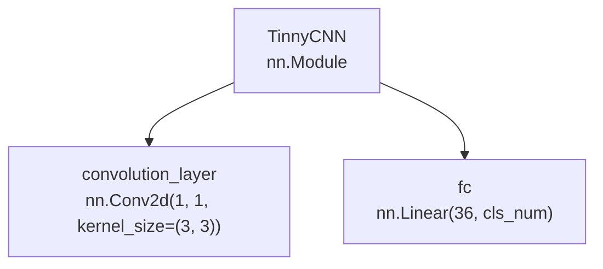
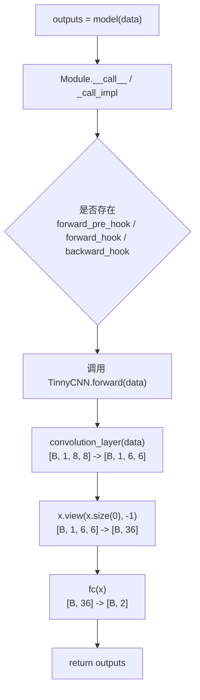

# Module & Parameter

## Module 的作用

`torch.nn.Module` 是 PyTorch 中构建神经网络的基础类。无论是一个完整模型，还是模型中的卷积层、线性层、激活层、容器层，本质上都可以看作一个 `Module`。

实际写模型时，`Module` 常用于这些场景：

- 自定义一个完整神经网络，例如 CNN、RNN、Transformer。
- 把多个网络层组织成一个可复用的模块。
- 自动管理模型中的子模块、参数、缓存状态和 hook。
- 配合优化器、保存加载模型、训练和推理流程使用。

创建一个模型时，最核心的是两个要素：

- 构建子模块：模型需要哪些网络层，例如卷积层、全连接层、池化层。
- 拼接子模块：输入数据经过这些层的先后顺序和计算规则。

下面用一个很小的 CNN 模型 `TinnyCNN` 作为贯穿示例。

```python
import torch
import torch.nn as nn


class TinnyCNN(nn.Module):
    def __init__(self, cls_num=2):
        super(TinnyCNN, self).__init__()
        self.convolution_layer = nn.Conv2d(1, 1, kernel_size=(3, 3))
        self.fc = nn.Linear(36, cls_num)

    def forward(self, x):
        x = self.convolution_layer(x)
        x = x.view(x.size(0), -1)
        out = self.fc(x)
        return out
```

## TinnyCNN 的模块嵌套关系

`TinnyCNN` 自身是一个 `Module`，它内部又包含两个子 `Module`：

- `convolution_layer`：一个二维卷积层 `nn.Conv2d`。
- `fc`：一个全连接层 `nn.Linear`。



这张图体现了 PyTorch 模型的常见结构：外层模型负责组织整体网络，内部网络层作为子模块被注册到模型中。

## Module 内部的关键属性

调用 `super(TinnyCNN, self).__init__()` 时，会先执行 `nn.Module` 的初始化逻辑。教学材料中常把 `Module.__init__` 理解为创建一组有序字典，用来管理模型内部的不同对象：

```python
self._modules = OrderedDict()
self._parameters = OrderedDict()
self._buffers = OrderedDict()
self._backward_hooks = OrderedDict()
self._forward_hooks = OrderedDict()
self._forward_pre_hooks = OrderedDict()
self._state_dict_hooks = OrderedDict()
self._load_state_dict_pre_hooks = OrderedDict()
```

不同 PyTorch 版本中，`Module` 内部属性可能继续扩展，但理解下面这几类已经足够掌握主线。

| 属性 | 管理内容 | 常见例子 |
| --- | --- | --- |
| `_modules` | 子模块，也就是 `nn.Module` 对象 | `Conv2d`、`Linear`、`Sequential` |
| `_parameters` | 当前模块直接持有的 `nn.Parameter` | 自定义权重、偏置 |
| `_buffers` | 不由优化器更新，但需要随模型保存的状态 | BatchNorm 的 `running_mean`、`running_var` |
| `_backward_hooks` | 反向传播 hook | 梯度调试、特征分析 |
| `_forward_hooks` | 前向传播后 hook | 读取中间特征 |
| `_forward_pre_hooks` | 前向传播前 hook | 输入检查或修改 |
| `_state_dict_hooks` | 保存 `state_dict` 时的 hook | 自定义保存逻辑 |
| `_load_state_dict_pre_hooks` | 加载 `state_dict` 前的 hook | 自定义加载前处理 |

重点看 `TinnyCNN.__init__` 中的两行：

```python
self.convolution_layer = nn.Conv2d(1, 1, kernel_size=(3, 3))
self.fc = nn.Linear(36, cls_num)
```

从 Python 角度看，这是给对象设置属性。更深一层看，`nn.Module` 重写了 `__setattr__`。当赋值右侧是一个 `nn.Module` 对象时，PyTorch 不只是把它保存成普通属性，还会把它注册进 `_modules`。

因此，`TinnyCNN` 初始化后，内部大致可以理解为：

```text
model._modules = OrderedDict([
    ("convolution_layer", Conv2d(1, 1, kernel_size=(3, 3), stride=(1, 1))),
    ("fc", Linear(in_features=36, out_features=2, bias=True)),
])
```

这就是为什么后续 `print(model)`、`model.parameters()`、`model.state_dict()` 都能自动找到这两个层。

## 子 Module 必须实现的方法

自定义一个 `nn.Module` 子类时，通常必须实现两个方法：`__init__` 和 `forward`。

### `__init__`：构建子模块

`__init__` 负责创建模型需要的网络层，并把它们保存为当前模型的属性。

```python
def __init__(self, cls_num=2):
    super(TinnyCNN, self).__init__()
    self.convolution_layer = nn.Conv2d(1, 1, kernel_size=(3, 3))
    self.fc = nn.Linear(36, cls_num)
```

这里做了三件事：

- `super(...).__init__()`：初始化父类 `nn.Module` 的管理机制。
- `self.convolution_layer = ...`：创建卷积层，并注册为子模块。
- `self.fc = ...`：创建全连接层，并注册为子模块。

如果输入图像形状是 `[B, 1, 8, 8]`，卷积层 `Conv2d(1, 1, kernel_size=(3, 3))` 默认 `stride=1`、`padding=0`，输出形状会变成 `[B, 1, 6, 6]`。展平后每个样本有 `1 * 6 * 6 = 36` 个特征，所以全连接层写成 `nn.Linear(36, cls_num)`。

### `forward`：拼接子模块

`forward` 负责定义数据如何从输入流向输出。

```python
def forward(self, x):
    x = self.convolution_layer(x)
    x = x.view(x.size(0), -1)
    out = self.fc(x)
    return out
```

它的执行过程是：

```text
输入 x: [B, 1, 8, 8]
    -> convolution_layer
卷积输出: [B, 1, 6, 6]
    -> view(x.size(0), -1)
展平输出: [B, 36]
    -> fc
最终输出: [B, cls_num]
```

`forward` 之于 `Module`，类似 `__getitem__` 之于 `Dataset`：

- `Dataset.__getitem__` 定义“给我一个索引，我如何返回一个样本”。
- `Module.forward` 定义“给我一批输入，我如何计算出模型输出”。

也就是说，`__init__` 只负责把积木准备好，`forward` 才负责把积木按顺序拼起来。

## TinnyCNN 的运行机制

实际训练或推理时，通常这样调用模型：

```python
model = TinnyCNN(cls_num=2)
data = torch.randn(4, 1, 8, 8)
outputs = model(data)
```

注意，推荐写法是 `model(data)`，不是 `model.forward(data)`。因为 `model(data)` 会先进入 `nn.Module` 的调用逻辑，再由 `Module` 在合适的位置调用 `forward`。



在 `Module` 的调用逻辑中，会处理 hook 等辅助机制。如果没有注册任何 hook，就会直接调用 `forward`。因此，日常训练中只需要记住：

```python
outputs = model(inputs)
```

不要绕过 `Module.__call__` 直接写：

```python
outputs = model.forward(inputs)
```

后者虽然在简单模型中也可能得到结果，但会跳过 `Module` 的一些统一管理逻辑。

构建一个 PyTorch 模型，可以总结为三步：

1. 写一个类继承 `nn.Module`。
2. 在 `__init__` 中把需要的网络层创建好。
3. 在 `forward` 中写清楚模型搭建和前向传播规则。

## Parameter 的含义

`torch.nn.Parameter` 可以理解为“带有模型参数身份的 Tensor”。它本质上仍然能像 Tensor 一样参与加法、矩阵乘法、求梯度等计算；特殊之处在于：当一个 `Parameter` 被赋值为 `nn.Module` 的属性时，PyTorch 会自动把它登记到这个模块的 `_parameters` 中。

也就是说，普通 Tensor 和 `Parameter` 的关键区别不在于能不能计算，而在于会不会被 `Module` 当作模型参数管理。

```python
import torch
import torch.nn as nn


class MyModule(nn.Module):
    def __init__(self):
        super().__init__()
        self.tensor_weight = torch.randn(2, 3)
        self.param_weight = nn.Parameter(torch.randn(2, 3))


model = MyModule()

for name, param in model.named_parameters():
    print(name, param.shape)
```

输出示例：

```text
param_weight torch.Size([2, 3])
```

可以看到，`tensor_weight` 虽然也是 Tensor，但不会出现在 `named_parameters()` 中；`param_weight` 是 `nn.Parameter`，因此会被模型识别为参数。

一个更接近 `nn.Linear` 的例子如下。这里没有直接使用 `nn.Linear`，而是手动用 `nn.Parameter` 定义权重和偏置。

```python
class MyLinear(nn.Module):
    def __init__(self, in_features, out_features, bias=True):
        super().__init__()
        self.weight = nn.Parameter(torch.randn(out_features, in_features))

        if bias:
            self.bias = nn.Parameter(torch.zeros(out_features))
        else:
            self.bias = None

    def forward(self, x):
        output = x @ self.weight.t()
        if self.bias is not None:
            output += self.bias
        return output
```

这段代码中：

- `self.weight` 的形状是 `[out_features, in_features]`，表示线性层的权重矩阵。
- `self.bias` 的形状是 `[out_features]`，表示每个输出特征对应一个偏置。
- `forward` 中的 `x @ self.weight.t()` 是矩阵乘法，等价于手动实现全连接层的核心计算。
- 因为 `weight` 和 `bias` 都是 `nn.Parameter`，所以它们会被 `model.parameters()` 找到，并在训练中由优化器更新。

例如：

```python
linear = MyLinear(in_features=3, out_features=2)

for name, param in linear.named_parameters():
    print(name, param.shape, param.requires_grad)
```

输出示例：

```text
weight torch.Size([2, 3]) True
bias torch.Size([2]) True
```

如果输入是 4 个样本，每个样本 3 个特征：

```python
x = torch.randn(4, 3)
output = linear(x)
print(output.shape)
```

输出示例：

```text
torch.Size([4, 2])
```

这说明 `Parameter` 既是计算图中的 Tensor，又是 `Module` 可以自动管理的可训练参数。

`Module` 和 `Parameter` 的关系可以这样理解：

- `Module` 管结构：模型由哪些层组成，前向传播怎么走。
- `Parameter` 管数值：这些层里面哪些 Tensor 是需要学习的。
- 外层 `Module` 会递归管理子模块中的 `Parameter`。

以 `TinnyCNN` 为例：

```text
TinnyCNN
├── convolution_layer
│   ├── weight: Parameter, shape = [1, 1, 3, 3]
│   └── bias: Parameter, shape = [1]
└── fc
    ├── weight: Parameter, shape = [2, 36]
    └── bias: Parameter, shape = [2]
```

这些 `weight` 和 `bias` 都是模型参数，会被 `model.parameters()` 找到，并传给优化器。

## `_parameters` 和 `Parameter` 的关系

前面说 `Parameter` 会被 `Module` 自动管理，具体管理位置就是模块内部的 `_parameters` 字典。

可以这样理解：

```text
nn.Parameter 是参数对象本身
module._parameters 是 Module 内部用来保存这些参数对象的字典
```

例如：

```python
class MyLinear(nn.Module):
    def __init__(self):
        super().__init__()
        self.weight = nn.Parameter(torch.randn(2, 3))
```

执行下面这行代码时：

```python
self.weight = nn.Parameter(torch.randn(2, 3))
```

`nn.Module.__setattr__` 会发现右侧是 `nn.Parameter`，于是把它登记到当前模块的 `_parameters` 中。可以近似理解为：

```python
self._parameters["weight"] = self.weight
```

所以这个模块内部大致是：

```text
MyLinear._parameters = {
    "weight": Parameter(...)
}
```

也就是说：

- `Parameter`：真正参与训练和更新的可学习 Tensor。
- `_parameters`：`Module` 内部保存这些 `Parameter` 的字典。
- `model.parameters()`：遍历这些字典，把里面的 `Parameter` 取出来。

需要注意，某个模块的 `_parameters` 只保存“当前模块自己直接拥有的参数”，不会把子模块的参数全都塞进当前模块。

以 `TinnyCNN` 为例：

```python
class TinnyCNN(nn.Module):
    def __init__(self, cls_num=2):
        super(TinnyCNN, self).__init__()
        self.convolution_layer = nn.Conv2d(1, 1, kernel_size=(3, 3))
        self.fc = nn.Linear(36, cls_num)
```

`TinnyCNN` 自己没有直接写：

```python
self.weight = nn.Parameter(...)
```

所以最外层的 `TinnyCNN._parameters` 通常是空的。它真正直接管理的是两个子模块：

```text
TinnyCNN._modules = {
    "convolution_layer": Conv2d(...),
    "fc": Linear(...)
}
```

参数则分别存放在子模块自己的 `_parameters` 中：

```text
TinnyCNN.convolution_layer._parameters = {
    "weight": Parameter(...),
    "bias": Parameter(...)
}

TinnyCNN.fc._parameters = {
    "weight": Parameter(...),
    "bias": Parameter(...)
}
```

因此，不能简单地以为“最外层模型的 `_parameters` 就包含全部参数”。更准确的理解是：每个 `Module` 都有自己的 `_parameters`，外层模型通过递归遍历整个 `Module` 树，才能拿到所有层的参数。

## 权重、参数、超参数的关系

学习 PyTorch 时，容易把“权重”“参数”“超参数”混在一起。可以这样区分：

| 概念 | 含义 | 是否由训练自动学习 | 例子 |
| --- | --- | --- | --- |
| 权重 | 某一层中的可学习矩阵或卷积核 | 是 | `Conv2d.weight`、`Linear.weight` |
| 参数 | 模型中所有可学习量的统称 | 是 | 权重、偏置 |
| 超参数 | 训练前由人指定的配置 | 否 | `lr`、`momentum`、`weight_decay`、`batch_size` |

所以，权重通常是参数的一部分；参数还包括偏置等其他可学习量；超参数不会被反向传播自动学习，而是控制训练过程。

## Parameter 在优化器中的作用

优化器需要知道“应该更新哪些参数”。因此创建优化器时，通常会把 `model.parameters()` 传进去：

```python
import torch.optim as optim


optimizer = optim.SGD(
    model.parameters(),
    lr=0.1,
    momentum=0.9,
    weight_decay=5e-4,
)
```

这里可以拆成两部分看：

- `model.parameters()`：告诉优化器要更新哪些 `Parameter`。
- `lr`、`momentum`、`weight_decay`：告诉优化器如何更新参数，这些属于超参数。

训练时，反向传播会把梯度保存到参数的 `.grad` 中，`optimizer.step()` 再根据这些梯度更新参数值。

```python
outputs = model(inputs)
loss = criterion(outputs, targets)

optimizer.zero_grad()
loss.backward()
optimizer.step()
```

## parameters 相关函数的设计思路

`nn.Module` 通过注册机制知道自己有哪些子模块和参数，所以可以提供一组遍历函数。

### `parameters()`

`parameters()` 返回模型中所有参数的迭代器，通常用于传给优化器。它的核心逻辑可以理解为：递归遍历当前 `Module` 以及所有子 `Module`，逐个查看每个模块自己的 `_parameters`，然后把里面的 `Parameter` 一个个取出来。

```python
for param in model.parameters():
    print(param.shape)
```

以 `TinnyCNN` 为例，`model.parameters()` 大致会按下面的思路工作：

```text
遍历 TinnyCNN._parameters
遍历 TinnyCNN._modules["convolution_layer"]._parameters
遍历 TinnyCNN._modules["fc"]._parameters
```

可以用伪代码理解为：

```python
for module in model 的所有 Module:
    for param in module._parameters.values():
        yield param
```

实际拿到的参数就是：

```text
convolution_layer.weight
convolution_layer.bias
fc.weight
fc.bias
```

`parameters()` 只返回参数本身，不返回参数名字。如果想知道参数来自哪一层，应使用 `named_parameters()`。

### `named_parameters()`

`named_parameters()` 返回参数名和参数对象，更适合调试和检查模型。

```python
for name, param in model.named_parameters():
    print(name, param.shape, param.requires_grad)
```

它会递归遍历当前模块及其子模块。例如 `TinnyCNN` 中的参数名会带上子模块名称：

```text
convolution_layer.weight
convolution_layer.bias
fc.weight
fc.bias
```

### `state_dict()`

`state_dict()` 返回模型的状态字典，里面包含参数，也包含需要保存的 buffer。

```python
state_dict = model.state_dict()
```

保存模型参数时，最常见的方式是保存 `state_dict`：

```python
torch.save(model.state_dict(), "tinnycnn.pth")
```

## 打印模型参数的常用命令

下面的示例都基于这个模型：

```python
model = TinnyCNN(cls_num=2)
```

### 打印模型结构

命令：

```python
print(model)
```

输出示例：

```text
TinnyCNN(
  (convolution_layer): Conv2d(1, 1, kernel_size=(3, 3), stride=(1, 1))
  (fc): Linear(in_features=36, out_features=2, bias=True)
)
```

这个命令适合快速查看模型由哪些子模块组成。

### 打印参数名、形状和是否参与训练

命令：

```python
for name, param in model.named_parameters():
    print(name, param.shape, param.requires_grad)
```

输出示例：

```text
convolution_layer.weight torch.Size([1, 1, 3, 3]) True
convolution_layer.bias torch.Size([1]) True
fc.weight torch.Size([2, 36]) True
fc.bias torch.Size([2]) True
```

这个命令最适合调试模型参数，因为它能同时看到参数名、维度和 `requires_grad` 状态。

### 只打印参数形状

命令：

```python
for param in model.parameters():
    print(param.shape)
```

输出示例：

```text
torch.Size([1, 1, 3, 3])
torch.Size([1])
torch.Size([2, 36])
torch.Size([2])
```

这个命令适合快速确认优化器能拿到哪些参数，但它不会显示参数名。

### 打印 state_dict 的键

命令：

```python
print(model.state_dict().keys())
```

输出示例：

```text
odict_keys(['convolution_layer.weight', 'convolution_layer.bias', 'fc.weight', 'fc.bias'])
```

这个命令适合检查模型保存和加载时会涉及哪些状态。

### 打印完整参数值

命令：

```python
for name, param in model.named_parameters():
    print(name)
    print(param)
```

输出示例：

```text
convolution_layer.weight
Parameter containing:
tensor([[[[ 0.1824, -0.0941,  0.2165],
          [-0.3152,  0.0528,  0.1087],
          [ 0.2713, -0.2016,  0.0449]]]], requires_grad=True)

convolution_layer.bias
Parameter containing:
tensor([0.1172], requires_grad=True)

fc.weight
Parameter containing:
tensor([[ 0.0231, -0.0814,  0.1128,  ..., -0.0416,  0.0589, -0.0972],
        [-0.0665,  0.1043, -0.0187,  ...,  0.1201, -0.0324,  0.0716]],
       requires_grad=True)

fc.bias
Parameter containing:
tensor([ 0.0842, -0.0527], requires_grad=True)
```

完整参数值来自随机初始化，每次运行通常不同。调试时更常看参数名、形状和 `requires_grad`，不一定需要打印全部数值。

## 小结

- `nn.Module` 是 PyTorch 构建模型的基础，完整模型和网络层都可以看作 `Module`。
- 自定义模型通常写成一个继承 `nn.Module` 的类。
- `__init__` 负责构建子模块，`forward` 负责拼接子模块并定义前向传播。
- `self.layer = nn.Linear(...)` 这类赋值会触发 `Module` 的注册机制，把子模块记录到 `_modules`。
- `Parameter` 是需要训练更新的特殊 Tensor，常见形式是各层的 `weight` 和 `bias`。
- `model.parameters()` 会递归收集模型中的参数，优化器依靠它知道应该更新哪些数值。
- 打印模型参数时，最常用的是 `print(model)`、`named_parameters()` 和 `state_dict().keys()`。
