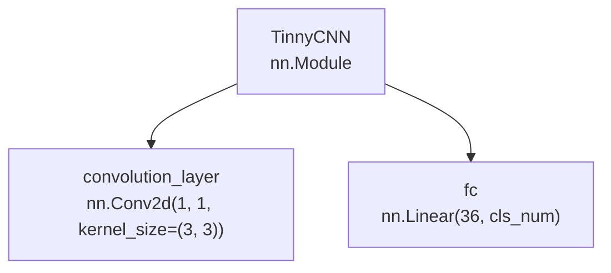
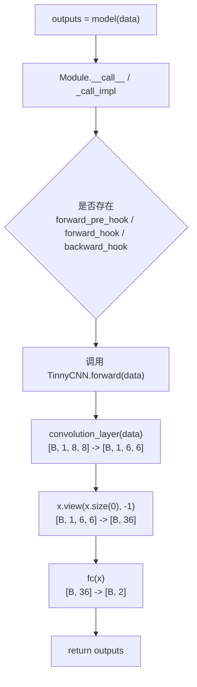

# 04-module_overview

## Module 的作用

`torch.nn.Module` 是 PyTorch 中构建神经网络的基础类。无论是一个完整模型，还是模型中的卷积层、线性层、激活层、容器层，本质上都可以看作一个 `Module`。

实际写模型时，`Module` 常用于这些场景：

- 自定义一个完整神经网络，例如 CNN、RNN、Transformer。
- 把多个网络层组织成一个可复用的模块。
- 自动管理模型中的子模块、参数、缓存状态和 hook。
- 配合优化器、保存加载模型、训练和推理流程使用。

创建一个模型时，最核心的是两个要素：

- 构建子模块：模型需要哪些网络层，例如卷积层、全连接层、池化层。
- 拼接子模块：输入数据经过这些层的先后顺序和计算规则。

下面用一个很小的 CNN 模型 `TinnyCNN` 作为贯穿示例。

```python
import torch
import torch.nn as nn


class TinnyCNN(nn.Module):
    def __init__(self, cls_num=2):
        super(TinnyCNN, self).__init__()
        self.convolution_layer = nn.Conv2d(1, 1, kernel_size=(3, 3))
        self.fc = nn.Linear(36, cls_num)

    def forward(self, x):
        x = self.convolution_layer(x)
        x = x.view(x.size(0), -1)
        out = self.fc(x)
        return out
```

## TinnyCNN 的模块嵌套关系

`TinnyCNN` 自身是一个 `Module`，它内部又包含两个子 `Module`：

- `convolution_layer`：一个二维卷积层 `nn.Conv2d`。
- `fc`：一个全连接层 `nn.Linear`。



这张图体现了 PyTorch 模型的常见结构：外层模型负责组织整体网络，内部网络层作为子模块被注册到模型中。

## Module 内部的关键属性

调用 `super(TinnyCNN, self).__init__()` 时，会先执行 `nn.Module` 的初始化逻辑。教学材料中常把 `Module.__init__` 理解为创建一组有序字典，用来管理模型内部的不同对象：

```python
self._modules = OrderedDict()
self._parameters = OrderedDict()
self._buffers = OrderedDict()
self._backward_hooks = OrderedDict()
self._forward_hooks = OrderedDict()
self._forward_pre_hooks = OrderedDict()
self._state_dict_hooks = OrderedDict()
self._load_state_dict_pre_hooks = OrderedDict()
```

不同 PyTorch 版本中，`Module` 内部属性可能继续扩展，但理解下面这几类已经足够掌握主线。

| 属性 | 管理内容 | 常见例子 |
| --- | --- | --- |
| `_modules` | 子模块，也就是 `nn.Module` 对象 | `Conv2d`、`Linear`、`Sequential` |
| `_parameters` | 当前模块直接持有的 `nn.Parameter` | 自定义权重、偏置 |
| `_buffers` | 不由优化器更新，但需要随模型保存的状态 | BatchNorm 的 `running_mean`、`running_var` |
| `_backward_hooks` | 反向传播 hook | 梯度调试、特征分析 |
| `_forward_hooks` | 前向传播后 hook | 读取中间特征 |
| `_forward_pre_hooks` | 前向传播前 hook | 输入检查或修改 |
| `_state_dict_hooks` | 保存 `state_dict` 时的 hook | 自定义保存逻辑 |
| `_load_state_dict_pre_hooks` | 加载 `state_dict` 前的 hook | 自定义加载前处理 |

重点看 `TinnyCNN.__init__` 中的两行：

```python
self.convolution_layer = nn.Conv2d(1, 1, kernel_size=(3, 3))
self.fc = nn.Linear(36, cls_num)
```

从 Python 角度看，这是给对象设置属性。更深一层看，`nn.Module` 重写了 `__setattr__`。当赋值右侧是一个 `nn.Module` 对象时，PyTorch 不只是把它保存成普通属性，还会把它注册进 `_modules`。

因此，`TinnyCNN` 初始化后，内部大致可以理解为：

```text
model._modules = OrderedDict([
    ("convolution_layer", Conv2d(1, 1, kernel_size=(3, 3), stride=(1, 1))),
    ("fc", Linear(in_features=36, out_features=2, bias=True)),
])
```

这就是为什么后续 `print(model)`、`model.parameters()`、`model.state_dict()` 都能自动找到这两个层。

## 子 Module 必须实现的方法

自定义一个 `nn.Module` 子类时，通常必须实现两个方法：`__init__` 和 `forward`。

### `__init__`：构建子模块

`__init__` 负责创建模型需要的网络层，并把它们保存为当前模型的属性。

```python
def __init__(self, cls_num=2):
    super(TinnyCNN, self).__init__()
    self.convolution_layer = nn.Conv2d(1, 1, kernel_size=(3, 3))
    self.fc = nn.Linear(36, cls_num)
```

这里做了三件事：

- `super(...).__init__()`：初始化父类 `nn.Module` 的管理机制。
- `self.convolution_layer = ...`：创建卷积层，并注册为子模块。
- `self.fc = ...`：创建全连接层，并注册为子模块。

如果输入图像形状是 `[B, 1, 8, 8]`，卷积层 `Conv2d(1, 1, kernel_size=(3, 3))` 默认 `stride=1`、`padding=0`，输出形状会变成 `[B, 1, 6, 6]`。展平后每个样本有 `1 * 6 * 6 = 36` 个特征，所以全连接层写成 `nn.Linear(36, cls_num)`。

### `forward`：拼接子模块

`forward` 负责定义数据如何从输入流向输出。

```python
def forward(self, x):
    x = self.convolution_layer(x)
    x = x.view(x.size(0), -1)
    out = self.fc(x)
    return out
```

它的执行过程是：

```text
输入 x: [B, 1, 8, 8]
    -> convolution_layer
卷积输出: [B, 1, 6, 6]
    -> view(x.size(0), -1)
展平输出: [B, 36]
    -> fc
最终输出: [B, cls_num]
```

`forward` 之于 `Module`，类似 `__getitem__` 之于 `Dataset`：

- `Dataset.__getitem__` 定义“给我一个索引，我如何返回一个样本”。
- `Module.forward` 定义“给我一批输入，我如何计算出模型输出”。

也就是说，`__init__` 只负责把积木准备好，`forward` 才负责把积木按顺序拼起来。

## TinnyCNN 的运行机制

理解 `TinnyCNN` 的运行机制，可以分成两条线：

- 模型创建线：执行 `__init__`，创建子模块，并把子模块和参数注册到 `Module` 内部。
- 模型调用线：执行 `model(data)`，进入 `Module.__call__`，再由它调用自定义的 `forward`。

### 创建模型：执行 `__init__`

当执行下面这行代码时：

```python
model = TinnyCNN(cls_num=2)
```

PyTorch 会进入 `TinnyCNN.__init__`：

```python
def __init__(self, cls_num=2):
    super(TinnyCNN, self).__init__()
    self.convolution_layer = nn.Conv2d(1, 1, kernel_size=(3, 3))
    self.fc = nn.Linear(36, cls_num)
```

这个阶段主要完成三件事：

1. `super(...).__init__()` 初始化 `nn.Module` 的内部管理结构。
2. `self.convolution_layer = ...` 创建卷积层，并注册到 `model._modules`。
3. `self.fc = ...` 创建全连接层，并注册到 `model._modules`。

所以模型创建完成后，`TinnyCNN` 大致形成下面的结构：

```text
TinnyCNN
├── _modules
│   ├── "convolution_layer" -> Conv2d(1, 1, kernel_size=(3, 3))
│   └── "fc" -> Linear(in_features=36, out_features=2)
└── forward
    └── 定义上面两个子模块如何被调用
```

### 调用模型：执行 `model(data)`

实际训练或推理时，通常这样调用模型：

```python
data = torch.randn(4, 1, 8, 8)
outputs = model(data)
```

推荐写法是 `model(data)`，不是 `model.forward(data)`。因为 `model(data)` 会先进入 `nn.Module` 的调用逻辑，再由 `Module` 在合适的位置调用 `forward`。



`Module.__call__` 或 `_call_impl` 会处理 forward hook、backward hook 等辅助机制。如果没有注册任何 hook，就会直接调用 `forward`。

因此，日常训练中应该写：

```python
outputs = model(inputs)
```

不建议直接写：

```python
outputs = model.forward(inputs)
```

后者虽然在简单模型中也可能得到结果，但会绕过 `Module.__call__` 中的统一管理逻辑。

### `forward` 中真正发生的计算

进入 `TinnyCNN.forward` 后，数据流才真正开始计算：

```python
def forward(self, x):
    x = self.convolution_layer(x)
    x = x.view(x.size(0), -1)
    out = self.fc(x)
    return out
```

如果输入 `data` 的形状是 `[4, 1, 8, 8]`，各步骤的形状变化是：

```text
data: [4, 1, 8, 8]
    -> convolution_layer
x:    [4, 1, 6, 6]
    -> view(x.size(0), -1)
x:    [4, 36]
    -> fc
out:  [4, 2]
```

这里可以看出，`__init__` 中只是创建了 `convolution_layer` 和 `fc`，而真正决定它们调用顺序的是 `forward`。

构建一个 PyTorch 模型，可以总结为三步：

1. 写一个类继承 `nn.Module`。
2. 在 `__init__` 中把需要的网络层创建好。
3. 在 `forward` 中写清楚模型搭建和前向传播规则。

## 小结

- `nn.Module` 是 PyTorch 构建模型的基础，完整模型和网络层都可以看作 `Module`。
- 自定义模型通常写成一个继承 `nn.Module` 的类。
- `__init__` 负责构建子模块，`forward` 负责拼接子模块并定义前向传播。
- `self.layer = nn.Linear(...)` 这类属性赋值会触发 `Module` 的注册机制，把子模块记录到 `_modules`。
- 调用模型时应使用 `model(inputs)`，让 `Module.__call__` 统一处理 hook 等辅助逻辑后再进入 `forward`。
