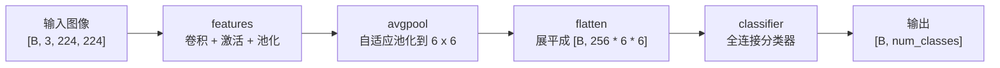

# 06-module_containers

本篇用于复习和速查 PyTorch 中常用的 `Module` 容器，按“容器概述 -> Sequential -> ModuleList -> ModuleDict”的顺序展开。

速查目录：

- `容器概述`：说明为什么需要把多个网络层组织到一起，以及容器和 `_modules` 的关系。
- `Sequential`：重点介绍两种构造方式、调用原理、内部迭代机制，以及 AlexNet 中的典型用法。
- `ModuleList`：说明它和普通 Python `list` 的区别，以及为什么它只负责管理模块、不自动定义前向传播。
- `ModuleDict`：说明它相比 `ModuleList` 的命名优势，以及如何按名字选择性调用网络层。

## 容器概述

在深度学习模型里，经常会有一些网络层需要成组使用。例如 CNN 中常见的组合是：

```text
Conv2d -> BatchNorm2d -> ReLU
```

如果每一层都单独写成一个属性，模型当然也能运行：

```python
self.conv = nn.Conv2d(3, 64, kernel_size=3, padding=1)
self.bn = nn.BatchNorm2d(64)
self.relu = nn.ReLU(inplace=True)
```

但当网络变深后，层和层之间的顺序关系会变得越来越多。`Module` 容器就是用来把一组 `Module` 捆绑在一起的工具。它们本身也是 `nn.Module`，所以可以继续被注册到外层模型的 `_modules` 中。

常用的模块容器有三类：

- `nn.Sequential`：按顺序连接多个模块，输入会依次经过每一层。
- `nn.ModuleList`：像 Python `list` 一样保存多个模块，但会正确注册这些模块。
- `nn.ModuleDict`：像 Python `dict` 一样按名字保存多个模块，也会正确注册这些模块。

这三者的核心区别是：`Sequential` 不只是保存模块，还定义了顺序前向传播；`ModuleList` 和 `ModuleDict` 主要负责保存和注册模块，真正怎么调用这些模块，需要用户在 `forward` 中自己写。

## Sequential

`nn.Sequential` 是最常见的模块容器。它适合表达“输入依次经过第 1 层、第 2 层、第 3 层……”这类线性结构。

### 两种构造方式

第一种方式是直接把多个 `Module` 按顺序传给 `Sequential`：

```python
import torch.nn as nn


model = nn.Sequential(
    nn.Conv2d(1, 20, 5),
    nn.ReLU(),
    nn.Conv2d(20, 64, 5),
    nn.ReLU(),
)
```

这种写法中，PyTorch 会自动用数字字符串作为每一层的名字，大致可以理解为：

```text
model._modules = {
    "0": Conv2d(1, 20, kernel_size=(5, 5)),
    "1": ReLU(),
    "2": Conv2d(20, 64, kernel_size=(5, 5)),
    "3": ReLU(),
}
```

第二种方式是传入 `OrderedDict`，这样可以给每一层指定名字：

```python
from collections import OrderedDict

import torch.nn as nn


model = nn.Sequential(OrderedDict([
    ("conv1", nn.Conv2d(1, 20, 5)),
    ("relu1", nn.ReLU()),
    ("conv2", nn.Conv2d(20, 64, 5)),
    ("relu2", nn.ReLU()),
]))
```

这和上面的模型在计算功能上是一样的，区别是 `_modules` 中的 key 更清楚：

```text
model._modules = {
    "conv1": Conv2d(1, 20, kernel_size=(5, 5)),
    "relu1": ReLU(),
    "conv2": Conv2d(20, 64, kernel_size=(5, 5)),
    "relu2": ReLU(),
}
```

如果只是快速搭建一个简单顺序结构，直接传多个层就够了；如果希望打印模型、保存参数名或调试中间层时更容易定位，使用 `OrderedDict` 命名会更清楚。

### Sequential 的调用原理

`Sequential` 本身也是 `nn.Module`。因此，当执行下面这行代码时：

```python
output = model(x)
```

它和普通自定义模型一样，仍然会先进入 `Module.__call__` 或 `_call_impl`，再调用 `Sequential.forward`。

`Sequential.forward` 的核心逻辑非常简洁：

```python
def forward(self, input):
    for module in self:
        input = module(input)
    return input
```

也就是说，输入 `x` 会依次被送入容器中的每一个子模块：

```text
x
  -> conv1
  -> relu1
  -> conv2
  -> relu2
  -> output
```

这里最关键的是这一句：

```python
for module in self:
```

为什么 `self` 可以被迭代？因为 `Sequential` 定义了 `__iter__`：

```python
def __iter__(self):
    return iter(self._modules.values())
```

`self._modules` 是 `Sequential` 内部保存子模块的有序字典，`self._modules.values()` 就是按插入顺序排列的各个网络层。因此：

- `for module in self` 会按顺序取出每一个子模块。
- `input = module(input)` 会把上一个模块的输出作为下一个模块的输入。
- 最后返回的是最后一层的输出。

这就是 `Sequential` 和 `ModuleList` 的重要区别：`Sequential` 默认假设这些模块可以首尾相接，所以它提供了现成的 `forward`；`ModuleList` 只是保存模块，不会替用户决定模块之间怎么连接。

### AlexNet 中的 Sequential

AlexNet 是理解 `Sequential` 的典型例子。下面是 torchvision 中 AlexNet 的主要结构，省略了权重加载等无关细节：

```python
import torch
import torch.nn as nn


class AlexNet(nn.Module):
    def __init__(self, num_classes=1000, dropout=0.5):
        super().__init__()
        self.features = nn.Sequential(
            nn.Conv2d(3, 64, kernel_size=11, stride=4, padding=2),
            nn.ReLU(inplace=True),
            nn.MaxPool2d(kernel_size=3, stride=2),
            nn.Conv2d(64, 192, kernel_size=5, padding=2),
            nn.ReLU(inplace=True),
            nn.MaxPool2d(kernel_size=3, stride=2),
            nn.Conv2d(192, 384, kernel_size=3, padding=1),
            nn.ReLU(inplace=True),
            nn.Conv2d(384, 256, kernel_size=3, padding=1),
            nn.ReLU(inplace=True),
            nn.Conv2d(256, 256, kernel_size=3, padding=1),
            nn.ReLU(inplace=True),
            nn.MaxPool2d(kernel_size=3, stride=2),
        )
        self.avgpool = nn.AdaptiveAvgPool2d((6, 6))
        self.classifier = nn.Sequential(
            nn.Dropout(p=dropout),
            nn.Linear(256 * 6 * 6, 4096),
            nn.ReLU(inplace=True),
            nn.Dropout(p=dropout),
            nn.Linear(4096, 4096),
            nn.ReLU(inplace=True),
            nn.Linear(4096, num_classes),
        )

    def forward(self, x):
        x = self.features(x)
        x = self.avgpool(x)
        x = torch.flatten(x, 1)
        x = self.classifier(x)
        return x
```

AlexNet 中有两个明显的 `Sequential`：

- `features`：负责特征提取，主要由卷积层、ReLU 和最大池化层组成。
- `classifier`：负责分类，主要由 Dropout、全连接层和 ReLU 组成。

整体前向传播流程可以理解为：



结合 AlexNet 的结构图，可以把左侧的卷积特征提取部分看作 `features`，右侧的全连接分类部分看作 `classifier`。中间的 `avgpool` 和 `flatten` 起到连接作用：卷积层输出仍然是四维特征图 `[B, C, H, W]`，而全连接层需要二维输入 `[B, feature_dim]`，所以必须先把空间尺寸固定，再展平成向量。

这里使用 `Sequential` 的好处是：卷积特征提取部分本身就是一串固定顺序的操作，分类器部分也是一串固定顺序的操作。把它们分别封装成 `features` 和 `classifier` 后，整个模型的 `forward` 就会非常清楚。

## ModuleList

`nn.ModuleList` 可以像 Python `list` 一样保存多个模块，也可以通过整数下标访问模块。它和普通 Python `list` 最大的区别是：`ModuleList` 中的模块会被正确注册到当前模型中。

下面构建一个包含 10 层全连接层的模型：

```python
import torch
import torch.nn as nn


class MyModule(nn.Module):
    def __init__(self):
        super(MyModule, self).__init__()
        self.linears = nn.ModuleList([
            nn.Linear(10, 10)
            for _ in range(10)
        ])

    def forward(self, x):
        for sub_layer in self.linears:
            x = sub_layer(x)
        return x


model = MyModule()
x = torch.randn(32, 10)
output = model(x)
print(output.shape)
```

输出示例：

```text
torch.Size([32, 10])
```

如果把 `ModuleList` 换成普通 Python `list`：

```python
self.linears = [
    nn.Linear(10, 10)
    for _ in range(10)
]
```

这些 `Linear` 层虽然也能在 `forward` 中被调用，但它们不会作为子模块被正确注册到外层模型里。直接后果是：

- `print(model)` 看不到这 10 个 `Linear` 层。
- `model.named_modules()` 不会把这些层当作模型子模块列出来。
- `model.parameters()` 找不到这些层的参数，优化器也就无法更新它们。

可以这样理解：

```text
普通 list：只是 Python 容器，PyTorch 不会递归管理里面的 Module。
ModuleList：是 nn.Module 容器，PyTorch 会把里面的 Module 注册进模型树。
```

不过，`ModuleList` 只负责保存和注册模块，不负责定义前向传播。它不像 `Sequential` 那样内置“上一层输出传给下一层”的规则，所以必须在 `forward` 中手动写调用逻辑。

这也是它的灵活之处。比如可以在 `forward` 中用循环、下标或条件判断决定哪些层被调用：

```python
def forward(self, x):
    for i, layer in enumerate(self.linears):
        if i % 2 == 0:
            x = layer(x)
    return x
```

因此，`ModuleList` 适合这类场景：

- 需要批量创建很多相似层。
- 层的数量由配置决定。
- 前向传播不是简单的首尾相接，而是需要循环、跳连、条件分支等自定义逻辑。

## ModuleDict

`nn.ModuleDict` 可以像 Python `dict` 一样，用名字保存和访问多个模块。

`ModuleList` 已经能管理多个模块，但它主要依靠整数下标定位层：

```python
self.layers[0]
self.layers[1]
self.layers[2]
```

在很深的网络中，仅靠下标定位不够直观。使用 `ModuleDict` 后，可以给每个模块一个清楚的名字：

```python
self.choices["conv"]
self.choices["pool"]
self.activations["lrelu"]
self.activations["prelu"]
```

下面是一个使用 `ModuleDict` 选择不同网络层和激活函数的例子：

```python
import torch
import torch.nn as nn


class MyModule2(nn.Module):
    def __init__(self):
        super(MyModule2, self).__init__()
        self.choices = nn.ModuleDict({
            "conv": nn.Conv2d(3, 16, 5),
            "pool": nn.MaxPool2d(3),
        })
        self.activations = nn.ModuleDict({
            "lrelu": nn.LeakyReLU(),
            "prelu": nn.PReLU(),
        })

    def forward(self, x, choice, act):
        x = self.choices[choice](x)
        x = self.activations[act](x)
        return x


model = MyModule2()
x = torch.randn(1, 3, 7, 7)

conv_out = model(x, choice="conv", act="lrelu")
pool_out = model(x, choice="pool", act="prelu")

print(conv_out.shape)
print(pool_out.shape)
```

输出示例：

```text
torch.Size([1, 16, 3, 3])
torch.Size([1, 3, 2, 2])
```

这段代码中：

- `self.choices` 保存可选的主体操作，比如卷积或池化。
- `self.activations` 保存可选的激活函数。
- `forward` 通过字符串参数 `choice` 和 `act` 决定本次前向传播调用哪一个模块。

`ModuleDict` 的优势不是自动前向传播，而是“按名字组织模块”。它适合这些场景：

- 模型中有多个可选分支，需要按名字选择其中一个。
- 希望模块名字能直接表达含义，方便调试和打印。
- 需要把一组同类模块放在一起管理，例如不同尺度的卷积分支、不同任务的输出头、不同类型的激活函数。

和 `ModuleList` 一样，`ModuleDict` 里的模块会被正确注册，但模块之间怎么连接，仍然要在 `forward` 中自己定义。

## 小结

`Module` 容器解决的是“如何组织多个子模块”的问题。它们都能把子模块纳入 PyTorch 的模型管理体系，但适用场景不同。

| 容器 | 访问方式 | 是否自动定义前向传播 | 适合场景 |
| --- | --- | --- | --- |
| `nn.Sequential` | 按顺序或按名字访问 | 是 | 多个层按固定顺序首尾相接 |
| `nn.ModuleList` | 按整数下标访问 | 否 | 批量保存多个层，并在 `forward` 中自定义调用逻辑 |
| `nn.ModuleDict` | 按字符串名字访问 | 否 | 按名字组织多个可选模块或分支 |

选择时可以按下面的规则判断：

- 如果网络层是简单顺序连接，优先用 `Sequential`。
- 如果需要保存一组层，并在 `forward` 里循环或按下标调用，用 `ModuleList`。
- 如果需要给每个层命名，并按名字选择不同分支，用 `ModuleDict`。

最重要的一点是：不要把需要训练的网络层直接放进普通 Python `list` 或 `dict` 中。只要希望 PyTorch 自动管理这些层，就应该使用对应的 `Module` 容器。
