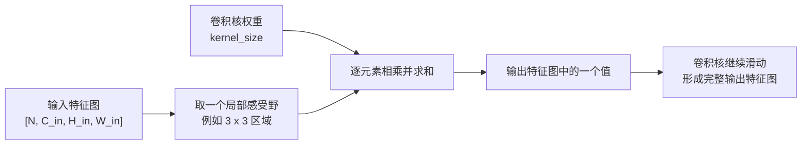
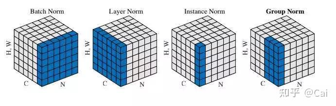

# 07-module_layers

本篇用于逐步整理 PyTorch 中常见的 `nn` 网络层，按“Layers 总览 -> Convolutional Layers -> Pooling Layers -> Normalization Layers -> 后续常见 layers”的顺序持续补充。

速查目录：

- `Layers 总览`：说明 layer 和 `nn.Module` 的关系，以及学习单个 layer 时应关注哪些问题。
- `Convolutional Layers`：介绍卷积层的基本思想，并重点剖析 `nn.Conv2d` 的参数、输入输出形状和输出尺寸公式。
- `Pooling Layers`：介绍池化层的降采样作用，重点说明 `nn.MaxPool2d` 和 `nn.AdaptiveMaxPool2d`。
- `Normalization Layers`：介绍常见归一化层，重点比较 `BatchNorm`、`LayerNorm`、`InstanceNorm` 和 `GroupNorm` 的统计范围、作用差异、参数和应用场景。
- 后续章节：每学习完一个常见 layer，就在本篇新增一个对应章节。

## Layers 总览

在 PyTorch 中，常见网络层通常都定义在 `torch.nn` 下，例如 `nn.Linear`、`nn.Conv2d`、`nn.ReLU`、`nn.BatchNorm2d`、`nn.MaxPool2d`。这些 layer 本质上都是 `nn.Module` 或与 `Module` 体系配合使用的组件。

学习一个 layer 时，不应只记住它的名字，还要理解它在模型中的位置：

- 它解决什么问题，例如特征变换、空间卷积、非线性激活、归一化、池化或正则化。
- 它是否包含可学习参数，例如 `Linear` 和 `Conv2d` 有权重，`ReLU` 通常没有权重。
- 它对输入输出形状有什么要求，尤其是 batch 维、通道维、特征维和空间维。
- 它在 `forward` 中如何被调用，以及常和哪些 layer 组合使用。
- 它有哪些常见易错点，例如维度不匹配、通道数写错、训练和推理行为不同。

可以把单个 layer 理解为模型中的一个计算单元：外层 `Module` 负责组织网络结构，而具体 layer 负责完成某一步张量计算。

```python
import torch
import torch.nn as nn


layer = nn.Linear(in_features=4, out_features=2)

x = torch.randn(3, 4)  # [batch_size, in_features]
y = layer(x)           # [batch_size, out_features]

print(y.shape)
```

这段代码中，`nn.Linear` 是一个具体 layer；它接收形状为 `[3, 4]` 的输入，把每个样本的 4 个特征映射成 2 个输出特征。

## Convolutional Layers

卷积层是 CNN 中最核心的网络层之一，常用于图像、特征图等具有空间结构的数据。它的基本思想是：用一个较小的卷积核在输入特征图上滑动，每次取一块局部区域，与卷积核中的权重逐元素相乘并求和，得到输出特征图上的一个位置。

卷积适合处理图像，主要因为它同时利用了两个特点：

- 局部连接：一个输出位置只关注输入中的一小块局部区域。
- 权重共享：同一个卷积核会在整张特征图上重复使用，用同一组参数提取相似模式。

卷积过程可以简化理解为：



本章节先重点学习二维卷积层 `nn.Conv2d`。它常用于处理图像输入或中间二维特征图，也是后续理解 CNN、ResNet、目标检测和语义分割模型的基础。

### Conv2d

#### 基本写法

`nn.Conv2d` 的常用函数形式如下：

```python
torch.nn.Conv2d(
    in_channels,
    out_channels,
    kernel_size,
    stride=1,
    padding=0,
    dilation=1,
    groups=1,
    bias=True,
    padding_mode="zeros",
)
```

它的主要功能是：对由多个二维平面组成的输入信号进行二维卷积。对图像来说，这里的“多个二维平面”通常就是多个通道，例如 RGB 图像有 3 个输入通道。

#### 参数

| 参数 | 含义 | 说明 |
| --- | --- | --- |
| `in_channels` | 输入通道数 | 输入到这一层的特征图通道数。RGB 原图通常是 3，上一层卷积输出多少通道，这一层的 `in_channels` 就应是多少。 |
| `out_channels` | 输出通道数 | 这一层输出的特征图通道数，也可以理解为卷积核组数。每个输出通道对应一组卷积核参数。 |
| `kernel_size` | 卷积核大小 | 可以是整数，也可以是二元组。`3` 表示高宽都是 `3`，`(3, 5)` 表示卷积核高度为 `3`、宽度为 `5`。 |
| `stride` | 步长 | 卷积核每次滑动的距离。`stride` 越大，输出特征图的高宽通常越小。 |
| `padding` | 填充 | 在输入特征图四周补像素。常用于保留边缘信息，或控制输出特征图大小。可以是整数、二元组，也可以是 `"valid"`、`"same"` 这类字符串模式。 |
| `dilation` | 空洞间隔 | 控制卷积核内部采样点之间的距离。`dilation=1` 是普通卷积，`dilation>1` 会扩大感受野。 |
| `groups` | 分组卷积数量 | 控制输入通道和输出通道之间的连接方式。`groups=1` 表示普通卷积；更大的 `groups` 会把通道分组后分别卷积。使用时要求 `in_channels` 和 `out_channels` 都能被 `groups` 整除。 |
| `bias` | 是否使用偏置 | 如果为 `True`，每个输出通道会额外学习一个偏置项。 |
| `padding_mode` | 填充方式 | 决定填充出来的像素值如何产生，常见值有 `"zeros"`、`"reflect"`、`"replicate"`、`"circular"`。默认是 `"zeros"`，也就是补 0。 |

几个参数可以传入单个整数，也可以传入二元组：

```python
nn.Conv2d(3, 16, kernel_size=3)
nn.Conv2d(3, 16, kernel_size=(3, 5), stride=(2, 1), padding=(1, 2))
```

单个整数表示高和宽使用同一个值；二元组中第一个值用于高度方向，第二个值用于宽度方向。

#### 感受野

感受野指的是：输出特征图上某一个位置，实际能看到输入特征图中的哪一块区域。

在单层 `Conv2d` 中，直接影响单个输出位置感受野大小的主要参数有：

- `kernel_size`：卷积核越大，单个输出位置直接看到的区域越大。
- `dilation`：卷积核内部采样点间隔越大，实际覆盖区域越大。

`stride` 不改变当前层单个输出位置的感受野大小，它改变的是卷积窗口每次移动多远，也就是相邻输出位置对应到输入上的位置间隔。`stride` 变大时，输出特征图会更稀疏，输出高宽通常会变小。

其中最容易忽略的是 `dilation`。它控制卷积核内部采样点之间的间隔。普通 `3 x 3` 卷积的 `dilation=1`，采样点是连续的：

```text
x x x
x x x
x x x
```

如果 `kernel_size=3` 且 `dilation=2`，卷积核参数仍然只有 `3 x 3 = 9` 个，但相邻采样点之间隔了 1 个位置：

```text
x . x . x
. . . . .
x . x . x
. . . . .
x . x . x
```

这时单个输出位置实际覆盖输入中的 `5 x 5` 区域。也就是说，`dilation` 的作用是：在不增加卷积核参数量的情况下扩大感受野。

单层卷积中，高度和宽度方向的感受野大小可以写成：

$$
R_h = dilation[0] \times (kernel\_size[0] - 1) + 1
$$

$$
R_w = dilation[1] \times (kernel\_size[1] - 1) + 1
$$

其中：

- `R_h`：高度方向上的实际感受野。
- `R_w`：宽度方向上的实际感受野。
- 在 PyTorch 中，`dilation=1` 表示相邻采样点间距为 1，也就是普通连续卷积；此时感受野大小等于卷积核大小。
- `dilation=0` 不是普通卷积的写法；如果从“空洞数量”角度理解，普通卷积可以说是采样点之间没有空洞。
- 当 `dilation>1` 时，采样点之间出现间隔，感受野会大于卷积核参数矩阵本身。

例如：

```text
kernel_size = 3
dilation = 2

R = 2 * (3 - 1) + 1 = 5
```

所以这个卷积核参数看起来是 `3 x 3`，但实际覆盖输入上的 `5 x 5` 区域。

#### 输入输出形状

`Conv2d` 的常见输入张量形状是：

```text
Input:  [N, C_in, H_in, W_in]
Output: [N, C_out, H_out, W_out]
```

其中：

- `N`：batch size，一次输入多少张图或多少个样本。
- `C_in`：输入通道数，对应 `in_channels`。
- `H_in`：输入特征图高度。
- `W_in`：输入特征图宽度。
- `C_out`：输出通道数，对应 `out_channels`。
- `H_out`：输出特征图高度。
- `W_out`：输出特征图宽度。

输出通道数由 `out_channels` 直接决定；输出高宽由输入大小、`padding`、感受野和 `stride` 共同决定。

先定义感受野：

$$
R_h = dilation[0] \times (kernel\_size[0] - 1) + 1
$$

$$
R_w = dilation[1] \times (kernel\_size[1] - 1) + 1
$$

则输出高宽可以写成：

$$
H_{out} =
\left\lfloor
\frac{H_{in} + 2 \times padding[0] - R_h}{stride[0]} + 1
\right\rfloor
$$

$$
W_{out} =
\left\lfloor
\frac{W_{in} + 2 \times padding[1] - R_w}{stride[1]} + 1
\right\rfloor
$$

这里的 $\lfloor \cdot \rfloor$ 表示向下取整。也就是说，如果卷积核滑动到最后时，剩余区域不够完整覆盖一个感受野，PyTorch 不会额外计算一次输出。

公式可以这样理解：

```text
填充后的输入大小 = 输入大小 + 2 * padding
可滑动范围 = 填充后的输入大小 - 感受野大小
可滑动次数 = 可滑动范围 / stride
输出大小 = floor(可滑动次数 + 1)
```

以高度方向为例：

```text
H_out = floor((H_in + 2 * padding[0] - R_h) / stride[0] + 1)
```

宽度方向同理。

如果把感受野 `R_h` 展开：

```text
R_h = dilation[0] * (kernel_size[0] - 1) + 1
```

就能得到 PyTorch 文档中更常见的形式：

```text
H_out = floor(
    (H_in + 2 * padding[0]
     - dilation[0] * (kernel_size[0] - 1)
     - 1) / stride[0]
    + 1
)
```

这个展开式和感受野版本是等价的，只是感受野版本更容易看出 `dilation` 的作用。

## Pooling Layers

池化层常用于对特征图做降采样：减少空间尺寸，保留局部区域中最重要或最有代表性的特征。池化层通常没有可学习参数，它更多是在控制特征图大小、扩大后续层的感受范围，并降低计算量。

以最大池化为例，`2 x 2` 池化窗口每次覆盖一个局部区域，并取这个区域里的最大值：

```text
Input 4 x 4:

2  2 | 7  3
9  4 | 6  1
-----+-----
8  5 | 2  4
3  1 | 2  6

MaxPool2d(kernel_size=2, stride=2)

Output 2 x 2:

9  7
8  6
```

这个例子说明了池化层的核心作用：把每个局部窗口压缩成一个值，从而让特征图的高宽变小。最大池化保留的是局部区域中的最大响应，常用于保留最显著的边缘、纹理或激活特征。

### MaxPool2d

`nn.MaxPool2d` 是二维最大池化层，常用于 CNN 的卷积层之后。

```python
torch.nn.MaxPool2d(
    kernel_size,
    stride=None,
    padding=0,
    dilation=1,
    return_indices=False,
    ceil_mode=False,
)
```

它的功能是：在输入特征图的每个通道上独立做二维最大池化。输入和输出通道数不会改变，变化的是特征图的高度和宽度。

| 参数 | 含义 | 说明 |
| --- | --- | --- |
| `kernel_size` | 池化窗口大小 | 每次在多大的局部区域中取最大值。可以是整数或二元组。 |
| `stride` | 滑动步长 | 池化窗口每次移动多远。默认是 `kernel_size`，这和卷积层默认 `stride=1` 不同。 |
| `padding` | 填充大小 | 在输入边缘补值。最大池化中补的是负无穷，避免补出来的值影响最大值选择。 |
| `dilation` | 窗口内采样间隔 | 控制池化窗口内部元素之间的间隔，普通情况为 `1`。 |
| `return_indices` | 是否返回最大值位置 | 为 `True` 时，除了池化结果，还会返回最大值在原窗口中的索引，常配合 `nn.MaxUnpool2d` 做反池化。 |
| `ceil_mode` | 是否向上取整 | 默认 `False`，输出尺寸按向下取整计算；为 `True` 时，输出尺寸按向上取整处理，边界窗口可能被保留下来。 |

常见写法：

```python
import torch
import torch.nn as nn


pool = nn.MaxPool2d(kernel_size=2, stride=2)

x = torch.tensor([[
    [[2., 2., 7., 3.],
     [9., 4., 6., 1.],
     [8., 5., 2., 4.],
     [3., 1., 2., 6.]]
]])  # [N, C, H, W] = [1, 1, 4, 4]

y = pool(x)

print(y)
print(y.shape)  # torch.Size([1, 1, 2, 2])
```

输出形状通常写成：

```text
Input:  [N, C, H_in, W_in]
Output: [N, C, H_out, W_out]
```

注意这里输出通道仍然是 `C`。池化层不像卷积层那样通过 `out_channels` 改变通道数，它只改变每个通道内部的空间尺寸。

### AdaptiveMaxPool2d

`nn.AdaptiveMaxPool2d` 是自适应最大池化层。它使用的池化方式仍然是 max pooling，也就是在每个池化区域内取最大值。

```python
torch.nn.AdaptiveMaxPool2d(
    output_size,
    return_indices=False,
)
```

普通 `MaxPool2d` 是先指定 `kernel_size`、`stride`，再由这些参数算出输出高宽；自适应最大池化反过来，用户直接指定目标输出大小，PyTorch 自动决定每个池化区域如何划分，然后对每个区域取最大值。

例如，不管输入特征图原来是 `8 x 9`、`10 x 10`，还是别的大小，下面这层都会把空间尺寸变成 `5 x 7`：

```python
pool = nn.AdaptiveMaxPool2d(output_size=(5, 7))

x = torch.randn(1, 64, 8, 9)
y = pool(x)

print(y.shape)  # torch.Size([1, 64, 5, 7])
```

`output_size` 的常见写法：

- `output_size=(H_out, W_out)`：指定输出高度和宽度。
- `output_size=7`：输出为 `7 x 7`。
- `output_size=(None, 7)`：高度保持和输入一致，宽度变成 `7`。

`return_indices` 的含义和 `MaxPool2d` 类似：如果为 `True`，会同时返回最大值所在位置，主要用于后续需要配合 `MaxUnpool2d` 恢复空间位置的场景。

自适应池化常用于模型尾部。例如分类模型中，前面的卷积网络可能接受不同尺寸的图片，但分类头通常希望输入固定大小。此时可以用：

```python
nn.AdaptiveMaxPool2d((1, 1))
```

把每个通道压缩成一个值，输出形状从 `[N, C, H, W]` 变成 `[N, C, 1, 1]`，再展平后接全连接层。

## Normalization Layers

Normalization Layers 指的是对中间特征做归一化的网络层。它们通常会先在某个维度范围内计算均值和方差，再把特征调整到更稳定的尺度，最后通过可学习参数 `weight` 和 `bias` 恢复模型需要的缩放和平移能力。

归一化层的核心价值是：让不同特征的数值尺度更稳定，降低训练过程中激活分布剧烈变化带来的影响，使优化过程更平滑、更容易收敛。常见 normalization layers 主要有四种：

- `BatchNorm`：Batch Normalization。
- `LayerNorm`：Layer Normalization。
- `InstanceNorm`：Instance Normalization。
- `GroupNorm`：Group Normalization。

在图像任务中，输入特征通常写成 `[N, C, H, W]`：

- `N`：batch size，一个 batch 中的样本数量。
- `C`：channel，特征图通道数。
- `H`：height，特征图高度。
- `W`：width，特征图宽度。

下面这张图展示了四种归一化方法在 `[N, C, H, W]` 特征上的统计范围。蓝色区域可以理解为“计算一次均值和方差时会使用的元素集合”。



| 方法 | 一次均值/方差的统计范围 | 是否依赖 batch 维 | 主要作用特点 | 常见应用场景 |
| --- | --- | --- | --- | --- |
| `BatchNorm2d` | 固定某个通道 `c`，统计 `N x H x W` | 依赖 | 对每个通道做跨样本、跨空间位置的归一化，统计量更稳定，但小 batch 时容易不可靠。 | CNN 分类、常规视觉模型、batch size 较稳定的训练。 |
| `LayerNorm` | 固定某个样本 `n`，统计该样本内部的 `C x H x W` 或指定特征维 | 不依赖 | 对单个样本的全部特征做归一化，适合样本之间长度或分布差异较大的任务。 | Transformer、RNN、NLP、小 batch 或变长序列任务。 |
| `InstanceNorm2d` | 固定某个样本 `n` 和通道 `c`，统计 `H x W` | 不依赖 | 每个样本、每个通道单独归一化，弱化单张图像的对比度、风格和亮度差异。 | 风格迁移、图像生成、需要去除实例风格差异的视觉任务。 |
| `GroupNorm` | 固定某个样本 `n`，把通道分组后统计 `C_group x H x W` | 不依赖 | 介于 `LayerNorm` 和 `InstanceNorm` 之间，既跨一部分通道统计，又不依赖 batch size。 | 小 batch 的检测、分割、视频任务，或显存限制下的 CNN。 |

直观理解：

- `BatchNorm` 是“同一个通道，在一个 batch 里一起归一化”。
- `LayerNorm` 是“同一个样本，所有被指定的特征一起归一化”。
- `InstanceNorm` 是“同一个样本的同一个通道，单独归一化”。
- `GroupNorm` 是“同一个样本的一组通道，一起归一化”。

### BatchNorm

`BatchNorm` 的典型二维版本是 `nn.BatchNorm2d`，常用于 CNN 中的卷积层之后。它的完整常用写法如下：

```python
torch.nn.BatchNorm2d(
    num_features,
    eps=1e-5,
    momentum=0.1,
    affine=True,
    track_running_stats=True,
    device=None,
    dtype=None,
    bias=True,
)
```

对输入 `[N, C, H, W]` 来说，`num_features` 应该等于 `C`。它会对每个通道分别计算均值和方差：

```text
对第 c 个通道：
统计范围 = x[:, c, :, :]
元素数量 = N * H * W
```

也就是说，`BatchNorm2d` 会把同一个通道在不同样本、不同空间位置上的值放在一起统计。这样做的好处是统计量通常比较稳定，尤其适合 batch size 较大的 CNN 训练。

参数说明：

| 参数 | 含义 | 说明 |
| --- | --- | --- |
| `num_features` | 通道数 | 输入特征的 `C`，也就是需要归一化的通道数量。 |
| `eps` | 数值稳定项 | 加到方差上，避免除以 0，默认 `1e-5`。 |
| `momentum` | running statistics 更新系数 | 用于更新 `running_mean` 和 `running_var`，默认 `0.1`。这里的 `momentum` 不是优化器里的动量。 |
| `affine` | 是否学习缩放和平移 | 为 `True` 时学习 `weight` 和 `bias`，每个通道各一个缩放和平移参数。 |
| `track_running_stats` | 是否记录运行时统计量 | 为 `True` 时训练阶段维护 `running_mean` 和 `running_var`，推理阶段默认使用它们。 |
| `device` | 参数所在设备 | 创建层时直接指定参数放在哪个设备上，通常不手动写，而是用 `model.to(device)`。 |
| `dtype` | 参数数据类型 | 创建层时指定参数类型，通常不手动写。 |
| `bias` | 是否学习平移项 | 只在 `affine=True` 时有效；为 `False` 时只学习缩放 `weight`，不学习加性偏置。 |

需要注意的是，`BatchNorm` 在训练和推理时行为不同：

- 训练时：使用当前 mini-batch 的均值和方差，并更新 running mean / running variance。
- 推理时：默认使用训练过程中累计得到的 running mean / running variance。

因此，`BatchNorm` 对 batch size 比较敏感。当 batch size 很小时，当前 batch 的统计量可能不稳定，训练效果会下降。

使用示范：

```python
import torch
import torch.nn as nn


bn = nn.BatchNorm2d(num_features=32)

x = torch.randn(8, 32, 16, 16)  # [N, C, H, W]
y = bn(x)

print(y.shape)  # torch.Size([8, 32, 16, 16])
```

在 CNN 中，它经常和卷积层、激活函数组合使用：

```python
block = nn.Sequential(
    nn.Conv2d(3, 32, kernel_size=3, padding=1, bias=False),
    nn.BatchNorm2d(32),
    nn.ReLU(),
)
```

### LayerNorm

`LayerNorm` 的典型写法是：

```python
torch.nn.LayerNorm(
    normalized_shape,
    eps=1e-5,
    elementwise_affine=True,
    bias=True,
    device=None,
    dtype=None,
)
```

它不跨样本统计，而是在每个样本内部，对指定的特征维度计算均值和方差。

如果把输入看作 `[N, C, H, W]`，并希望对每个样本的全部特征归一化，可以理解为：

```text
对第 n 个样本：
统计范围 = x[n, :, :, :]
元素数量 = C * H * W
```

`LayerNorm` 的关键特点是：每个样本独立计算统计量，不依赖 batch size。因此它很适合 Transformer、RNN、NLP 和小 batch 场景。

参数说明：

| 参数 | 含义 | 说明 |
| --- | --- | --- |
| `normalized_shape` | 被归一化的尾部维度形状 | `LayerNorm` 会对输入最后若干个维度计算均值和方差。若写成 `128`，表示只归一化最后一维；若写成 `[C, H, W]`，表示归一化最后三维。 |
| `eps` | 数值稳定项 | 加到方差上，避免除以 0，默认 `1e-5`。 |
| `elementwise_affine` | 是否学习逐元素缩放和平移 | 为 `True` 时学习和 `normalized_shape` 同形状的 `weight` 和 `bias`。注意它不是每个通道一个参数，而是被归一化范围内每个位置都可以有参数。 |
| `bias` | 是否学习平移项 | 只在 `elementwise_affine=True` 时有效；为 `False` 时只学习 `weight`。 |
| `device` | 参数所在设备 | 创建层时直接指定参数设备，通常用 `model.to(device)` 统一处理。 |
| `dtype` | 参数数据类型 | 创建层时指定参数类型，通常不手动写。 |

在 Transformer 中，输入通常不是 `[N, C, H, W]`，而是类似 `[batch, seq_len, hidden_size]` 的张量。此时 `LayerNorm` 通常对最后一个 hidden 维度做归一化：

```python
nn.LayerNorm(hidden_size)
```

使用示范：

```python
import torch
import torch.nn as nn


# Transformer / NLP 常见写法：归一化最后一维 hidden_size
x = torch.randn(8, 20, 128)  # [batch, seq_len, hidden_size]
ln = nn.LayerNorm(normalized_shape=128)
y = ln(x)

print(y.shape)  # torch.Size([8, 20, 128])
```

如果用于 `[N, C, H, W]` 图像特征，并希望每个样本内部的 `C x H x W` 一起归一化：

```python
x = torch.randn(8, 32, 16, 16)
ln = nn.LayerNorm(normalized_shape=[32, 16, 16])
y = ln(x)

print(y.shape)  # torch.Size([8, 32, 16, 16])
```

### InstanceNorm

`InstanceNorm` 的典型二维版本是 `nn.InstanceNorm2d`：

```python
torch.nn.InstanceNorm2d(
    num_features,
    eps=1e-5,
    momentum=0.1,
    affine=False,
    track_running_stats=False,
    device=None,
    dtype=None,
    bias=True,
)
```

对输入 `[N, C, H, W]` 来说，它会对每个样本的每个通道单独计算均值和方差：

```text
对第 n 个样本、第 c 个通道：
统计范围 = x[n, c, :, :]
元素数量 = H * W
```

它不使用 batch 中其他样本的信息，也不跨通道统计。这样会更强地去掉单张图像内部某个通道的整体亮度、对比度和风格信息。

因此，`InstanceNorm` 常用于风格迁移和图像生成任务。因为这些任务里，模型往往希望弱化原图自己的风格统计，把内容结构和风格表现拆开处理。

参数说明：

| 参数 | 含义 | 说明 |
| --- | --- | --- |
| `num_features` | 通道数 | 输入特征的 `C`。 |
| `eps` | 数值稳定项 | 加到方差上，避免除以 0，默认 `1e-5`。 |
| `momentum` | running statistics 更新系数 | 只有在 `track_running_stats=True` 时才用于更新运行时均值和方差。 |
| `affine` | 是否学习缩放和平移 | 默认 `False`，这点和 `BatchNorm2d` 不同；为 `True` 时每个通道学习一组 `weight` 和 `bias`。 |
| `track_running_stats` | 是否记录运行时统计量 | 默认 `False`，表示训练和推理都使用当前输入自己的 instance statistics。 |
| `device` | 参数所在设备 | 创建层时直接指定参数设备，通常不手动写。 |
| `dtype` | 参数数据类型 | 创建层时指定参数类型，通常不手动写。 |
| `bias` | 是否学习平移项 | 只在 `affine=True` 时有效；为 `False` 时不学习加性偏置。 |

使用示范：

```python
import torch
import torch.nn as nn


inorm = nn.InstanceNorm2d(num_features=32, affine=True)

x = torch.randn(8, 32, 16, 16)
y = inorm(x)

print(y.shape)  # torch.Size([8, 32, 16, 16])
```

如果更接近风格迁移中常见设置，也可以不使用可学习仿射参数：

```python
style_norm = nn.InstanceNorm2d(num_features=32, affine=False)
```

### GroupNorm

`GroupNorm` 的典型写法是：

```python
torch.nn.GroupNorm(
    num_groups,
    num_channels,
    eps=1e-5,
    affine=True,
    device=None,
    dtype=None,
    bias=True,
)
```

它会把 `C` 个通道分成 `num_groups` 组，然后在每个样本内部、每个通道组内部计算均值和方差。

对输入 `[N, C, H, W]` 来说，如果每组有 `C_group = C / num_groups` 个通道，可以理解为：

```text
对第 n 个样本、第 g 个通道组：
统计范围 = x[n, group_g, :, :]
元素数量 = C_group * H * W
```

`GroupNorm` 不依赖 batch 维，因此小 batch 下通常比 `BatchNorm` 更稳定。同时它又不会像 `InstanceNorm` 那样每个通道完全独立，而是保留了一部分跨通道的统计关系。

参数说明：

| 参数 | 含义 | 说明 |
| --- | --- | --- |
| `num_groups` | 通道分组数量 | 把 `num_channels` 个通道分成多少组。要求 `num_channels` 能被 `num_groups` 整除。 |
| `num_channels` | 输入通道数 | 输入特征的 `C`。 |
| `eps` | 数值稳定项 | 加到方差上，避免除以 0，默认 `1e-5`。 |
| `affine` | 是否学习缩放和平移 | 为 `True` 时学习每个通道一组 `weight` 和 `bias`。 |
| `device` | 参数所在设备 | 创建层时直接指定参数设备，通常不手动写。 |
| `dtype` | 参数数据类型 | 创建层时指定参数类型，通常不手动写。 |
| `bias` | 是否学习平移项 | 只在 `affine=True` 时有效；为 `False` 时不学习加性偏置。 |

可以把 `GroupNorm` 看成一个折中方案：

- 当 `num_groups=1` 时，所有通道在同一组，接近 `LayerNorm` 在 `[C, H, W]` 上的行为。
- 当 `num_groups=C` 时，每个通道单独成组，接近 `InstanceNorm` 的行为。

在目标检测、语义分割、视频模型等显存压力较大、batch size 往往较小的任务中，`GroupNorm` 是很常见的选择。

使用示范：

```python
import torch
import torch.nn as nn


gn = nn.GroupNorm(num_groups=8, num_channels=32)

x = torch.randn(8, 32, 16, 16)
y = gn(x)

print(y.shape)  # torch.Size([8, 32, 16, 16])
```

几个特殊写法：

```python
# 所有通道放到 1 组，接近 LayerNorm 在 [C, H, W] 上的效果
gn_like_ln = nn.GroupNorm(num_groups=1, num_channels=32)

# 每个通道单独成组，接近 InstanceNorm
gn_like_in = nn.GroupNorm(num_groups=32, num_channels=32)
```

参考资料：

- [Normalization layers 差异图示参考](https://zhuanlan.zhihu.com/p/480250123)
- [PyTorch BatchNorm2d](https://pytorch.org/docs/stable/generated/torch.nn.BatchNorm2d.html)
- [PyTorch LayerNorm](https://pytorch.org/docs/stable/generated/torch.nn.LayerNorm.html)
- [PyTorch InstanceNorm2d](https://pytorch.org/docs/stable/generated/torch.nn.InstanceNorm2d.html)
- [PyTorch GroupNorm](https://pytorch.org/docs/stable/generated/torch.nn.GroupNorm.html)
