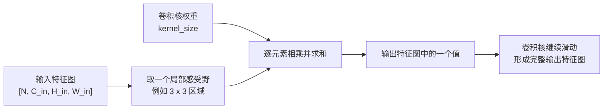

# 07-module_layer

本篇用于逐步整理 PyTorch 中常见的 `nn` 网络层，按“Layer 总览 -> Convolutional Layers -> 后续常见 layer”的顺序持续补充。

速查目录：

- `Layer 总览`：说明 layer 和 `nn.Module` 的关系，以及学习单个 layer 时应关注哪些问题。
- `Convolutional Layers`：介绍卷积层的基本思想，并重点剖析 `nn.Conv2d` 的参数、输入输出形状和输出尺寸公式。
- `单个 layer 的整理格式`：约定后续每个网络层章节的固定结构，方便复习和继续追加内容。
- 后续章节：每学习完一个常见 layer，就在本篇新增一个对应章节。

## Layer 总览

在 PyTorch 中，常见网络层通常都定义在 `torch.nn` 下，例如 `nn.Linear`、`nn.Conv2d`、`nn.ReLU`、`nn.BatchNorm2d`、`nn.MaxPool2d`。这些 layer 本质上都是 `nn.Module` 或与 `Module` 体系配合使用的组件。

学习一个 layer 时，不应只记住它的名字，还要理解它在模型中的位置：

- 它解决什么问题，例如特征变换、空间卷积、非线性激活、归一化、池化或正则化。
- 它是否包含可学习参数，例如 `Linear` 和 `Conv2d` 有权重，`ReLU` 通常没有权重。
- 它对输入输出形状有什么要求，尤其是 batch 维、通道维、特征维和空间维。
- 它在 `forward` 中如何被调用，以及常和哪些 layer 组合使用。
- 它有哪些常见易错点，例如维度不匹配、通道数写错、训练和推理行为不同。

可以把单个 layer 理解为模型中的一个计算单元：外层 `Module` 负责组织网络结构，而具体 layer 负责完成某一步张量计算。

```python
import torch
import torch.nn as nn


layer = nn.Linear(in_features=4, out_features=2)

x = torch.randn(3, 4)  # [batch_size, in_features]
y = layer(x)           # [batch_size, out_features]

print(y.shape)
```

这段代码中，`nn.Linear` 是一个具体 layer；它接收形状为 `[3, 4]` 的输入，把每个样本的 4 个特征映射成 2 个输出特征。

## Convolutional Layers

卷积层是 CNN 中最核心的网络层之一，常用于图像、特征图等具有空间结构的数据。它的基本思想是：用一个较小的卷积核在输入特征图上滑动，每次取一块局部区域，与卷积核中的权重逐元素相乘并求和，得到输出特征图上的一个位置。

卷积适合处理图像，主要因为它同时利用了两个特点：

- 局部连接：一个输出位置只关注输入中的一小块局部区域。
- 权重共享：同一个卷积核会在整张特征图上重复使用，用同一组参数提取相似模式。

卷积过程可以简化理解为：



本章节先重点学习二维卷积层 `nn.Conv2d`。它常用于处理图像输入或中间二维特征图，也是后续理解 CNN、ResNet、目标检测和语义分割模型的基础。

### Conv2d 的基本写法

`nn.Conv2d` 的常用函数形式如下：

```python
torch.nn.Conv2d(
    in_channels,
    out_channels,
    kernel_size,
    stride=1,
    padding=0,
    dilation=1,
    groups=1,
    bias=True,
    padding_mode="zeros",
)
```

它的主要功能是：对由多个二维平面组成的输入信号进行二维卷积。对图像来说，这里的“多个二维平面”通常就是多个通道，例如 RGB 图像有 3 个输入通道。

### Conv2d 参数

| 参数 | 含义 | 说明 |
| --- | --- | --- |
| `in_channels` | 输入通道数 | 输入到这一层的特征图通道数。RGB 原图通常是 3，上一层卷积输出多少通道，这一层的 `in_channels` 就应是多少。 |
| `out_channels` | 输出通道数 | 这一层输出的特征图通道数，也可以理解为卷积核组数。每个输出通道对应一组卷积核参数。 |
| `kernel_size` | 卷积核大小 | 可以是整数，也可以是二元组。`3` 表示高宽都是 `3`，`(3, 5)` 表示卷积核高度为 `3`、宽度为 `5`。 |
| `stride` | 步长 | 卷积核每次滑动的距离。`stride` 越大，输出特征图的高宽通常越小。 |
| `padding` | 填充 | 在输入特征图四周补像素。常用于保留边缘信息，或控制输出特征图大小。可以是整数、二元组，也可以是 `"valid"`、`"same"` 这类字符串模式。 |
| `dilation` | 空洞间隔 | 控制卷积核内部采样点之间的距离。`dilation=1` 是普通卷积，`dilation>1` 会扩大感受野。 |
| `groups` | 分组卷积数量 | 控制输入通道和输出通道之间的连接方式。`groups=1` 表示普通卷积；更大的 `groups` 会把通道分组后分别卷积。使用时要求 `in_channels` 和 `out_channels` 都能被 `groups` 整除。 |
| `bias` | 是否使用偏置 | 如果为 `True`，每个输出通道会额外学习一个偏置项。 |
| `padding_mode` | 填充方式 | 决定填充出来的像素值如何产生，常见值有 `"zeros"`、`"reflect"`、`"replicate"`、`"circular"`。默认是 `"zeros"`，也就是补 0。 |

几个参数可以传入单个整数，也可以传入二元组：

```python
nn.Conv2d(3, 16, kernel_size=3)
nn.Conv2d(3, 16, kernel_size=(3, 5), stride=(2, 1), padding=(1, 2))
```

单个整数表示高和宽使用同一个值；二元组中第一个值用于高度方向，第二个值用于宽度方向。

### 感受野

感受野指的是：输出特征图上某一个位置，实际能看到输入特征图中的哪一块区域。

在单层 `Conv2d` 中，直接影响单个输出位置感受野大小的主要参数有：

- `kernel_size`：卷积核越大，单个输出位置直接看到的区域越大。
- `dilation`：卷积核内部采样点间隔越大，实际覆盖区域越大。

`stride` 不改变当前层单个输出位置的感受野大小，它改变的是卷积窗口每次移动多远，也就是相邻输出位置对应到输入上的位置间隔。`stride` 变大时，输出特征图会更稀疏，输出高宽通常会变小。

其中最容易忽略的是 `dilation`。它控制卷积核内部采样点之间的间隔。普通 `3 x 3` 卷积的 `dilation=1`，采样点是连续的：

```text
x x x
x x x
x x x
```

如果 `kernel_size=3` 且 `dilation=2`，卷积核参数仍然只有 `3 x 3 = 9` 个，但相邻采样点之间隔了 1 个位置：

```text
x . x . x
. . . . .
x . x . x
. . . . .
x . x . x
```

这时单个输出位置实际覆盖输入中的 `5 x 5` 区域。也就是说，`dilation` 的作用是：在不增加卷积核参数量的情况下扩大感受野。

单层卷积中，高度和宽度方向的感受野大小可以写成：

$$
R_h = dilation[0] \times (kernel\_size[0] - 1) + 1
$$

$$
R_w = dilation[1] \times (kernel\_size[1] - 1) + 1
$$

其中：

- `R_h`：高度方向上的实际感受野。
- `R_w`：宽度方向上的实际感受野。
- 在 PyTorch 中，`dilation=1` 表示相邻采样点间距为 1，也就是普通连续卷积；此时感受野大小等于卷积核大小。
- `dilation=0` 不是普通卷积的写法；如果从“空洞数量”角度理解，普通卷积可以说是采样点之间没有空洞。
- 当 `dilation>1` 时，采样点之间出现间隔，感受野会大于卷积核参数矩阵本身。

例如：

```text
kernel_size = 3
dilation = 2

R = 2 * (3 - 1) + 1 = 5
```

所以这个卷积核参数看起来是 `3 x 3`，但实际覆盖输入上的 `5 x 5` 区域。

### Conv2d 输入输出形状

`Conv2d` 的常见输入张量形状是：

```text
Input:  [N, C_in, H_in, W_in]
Output: [N, C_out, H_out, W_out]
```

其中：

- `N`：batch size，一次输入多少张图或多少个样本。
- `C_in`：输入通道数，对应 `in_channels`。
- `H_in`：输入特征图高度。
- `W_in`：输入特征图宽度。
- `C_out`：输出通道数，对应 `out_channels`。
- `H_out`：输出特征图高度。
- `W_out`：输出特征图宽度。

输出通道数由 `out_channels` 直接决定；输出高宽由输入大小、`padding`、感受野和 `stride` 共同决定。

先定义感受野：

$$
R_h = dilation[0] \times (kernel\_size[0] - 1) + 1
$$

$$
R_w = dilation[1] \times (kernel\_size[1] - 1) + 1
$$

则输出高宽可以写成：

$$
H_{out} =
\left\lfloor
\frac{H_{in} + 2 \times padding[0] - R_h}{stride[0]} + 1
\right\rfloor
$$

$$
W_{out} =
\left\lfloor
\frac{W_{in} + 2 \times padding[1] - R_w}{stride[1]} + 1
\right\rfloor
$$

这里的 $\lfloor \cdot \rfloor$ 表示向下取整。也就是说，如果卷积核滑动到最后时，剩余区域不够完整覆盖一个感受野，PyTorch 不会额外计算一次输出。

公式可以这样理解：

```text
填充后的输入大小 = 输入大小 + 2 * padding
可滑动范围 = 填充后的输入大小 - 感受野大小
可滑动次数 = 可滑动范围 / stride
输出大小 = floor(可滑动次数 + 1)
```

以高度方向为例：

```text
H_out = floor((H_in + 2 * padding[0] - R_h) / stride[0] + 1)
```

宽度方向同理。

如果把感受野 `R_h` 展开：

```text
R_h = dilation[0] * (kernel_size[0] - 1) + 1
```

就能得到 PyTorch 文档中更常见的形式：

```text
H_out = floor(
    (H_in + 2 * padding[0]
     - dilation[0] * (kernel_size[0] - 1)
     - 1) / stride[0]
    + 1
)
```

这个展开式和感受野版本是等价的，只是感受野版本更容易看出 `dilation` 的作用。

## 单个 layer 的整理格式

后续每学习完一个 layer，就按下面结构整理成一个二级章节：

```text
## Layer 名称

### 作用

说明这个 layer 用来做什么，通常放在模型的什么位置。

### 常用参数

解释最常用、最容易写错的参数。

### 输入输出形状

写清楚输入张量和输出张量的维度变化。

### 代码示例

给出最小但完整的 PyTorch 示例。

### 易错点

整理维度、参数、训练推理差异等常见问题。
```

这个格式不是为了限制内容，而是为了保证每个 layer 的笔记都能围绕“怎么用、输入输出是什么、哪里容易错”来展开。
