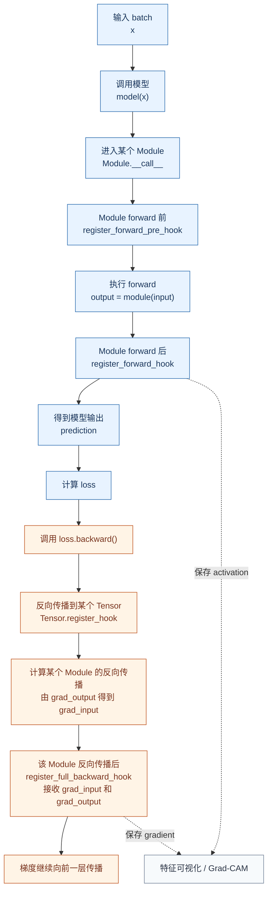

# 08-hooks

本篇整理 PyTorch 中常用的 hook 机制，按“Hook 概念 -> Hook 应用位置图 -> 常用 Hook 对比 -> register_forward_pre_hook -> register_forward_hook -> Tensor.register_hook -> register_full_backward_hook -> 易错点 -> 小结”的顺序组织。阅读时可以先看流程图明确各类 hook 在计算流程中的位置，再按流程图从上到下理解每种 hook 的作用、用法和示例。

速查目录：

- `Hook 概念`：说明 hook 是什么、为什么需要 hook，以及它和 `forward`、反向传播的关系。
- `Hook 应用位置图`：用一张流程图展示常用 hook 在前向传播和反向传播中的触发位置。
- `常用 Hook 对比`：比较常用 hook 的注册对象、触发时机、函数签名和典型用途。
- `register_forward_pre_hook`：在模块执行 `forward` 前触发，适合检查或调整输入。
- `register_forward_hook`：在模块执行 `forward` 后触发，适合保存中间特征或观察输出形状。
- `Tensor.register_hook`：在某个张量梯度被计算时触发，适合读取或替换该张量的梯度。
- `register_full_backward_hook`：在模块梯度计算后触发，适合保存输入梯度、输出梯度或实现 Grad-CAM 一类分析。
- `易错点`：整理 hook 使用中容易出错的地方。

## Hook 概念

Hook 可以理解为 PyTorch 在特定计算节点上预留的“回调函数”。注册 hook 之后，不需要改写模型的 `forward` 或训练循环，PyTorch 会在指定时机自动调用用户定义的函数。

常见使用场景包括：

- 调试模型：打印某一层的输入、输出形状，确认张量是否符合预期。
- 提取中间特征：保存卷积层输出，用于特征可视化或 Grad-CAM。
- 观察梯度：检查某一层或某个张量的梯度是否消失、爆炸或为 `None`。
- 修改数据流：在前向传播前调整输入，在反向传播中替换某些梯度。

Hook 的关键点是“注册到谁身上、什么时候触发、能不能修改值”：

- 注册到 `nn.Module` 上的 hook，关注的是某个网络层或子模块的输入、输出和梯度。
- 注册到 `Tensor` 上的 hook，关注的是某个张量本身的梯度。
- 前向 hook 在 `model(x)` 触发的调用链中执行，因此不要直接调用 `model.forward(x)` 绕过 `Module.__call__`。
- 大多数 hook 注册后会返回一个 `handle`，不再需要时应调用 `handle.remove()` 移除。

最小注册形式如下：

```python
handle = module.register_forward_hook(hook_fn)

# 使用模型，hook_fn 会在指定时机自动执行
output = module(input_tensor)

# 不再需要 hook 时移除
handle.remove()
```

## Hook 应用位置图

下面这张图按一次常见训练迭代的顺序展示常用 hook 的触发位置。图中蓝色是前向传播阶段，橙色是反向传播阶段。



按这张图可以把常用 hook 分成四个位置：

- `register_forward_pre_hook`：模块 `forward` 前，先看或改输入。
- `register_forward_hook`：模块 `forward` 后，先看或保存输出。
- `Tensor.register_hook`：某个张量的梯度被计算出来时，读取或替换这个张量的梯度。
- `register_full_backward_hook`：某个模块完成反向梯度计算后，读取 `grad_input` 和 `grad_output`。

## 常用 Hook 对比

| Hook 函数 | 注册对象 | 触发时机 | Hook 函数签名 | 是否常用于修改值 | 典型用途 |
| --- | --- | --- | --- | --- | --- |
| `module.register_forward_pre_hook` | `nn.Module` | 模块 `forward` 执行前 | `hook(module, args)` 或 `hook(module, args, kwargs)` | 可以返回新的输入 | 输入检查、输入预处理、临时替换输入 |
| `module.register_forward_hook` | `nn.Module` | 模块 `forward` 执行后 | `hook(module, args, output)` 或 `hook(module, args, kwargs, output)` | 可以返回新的输出 | 保存中间特征、打印输出形状、特征可视化 |
| `tensor.register_hook` | `Tensor` | 该张量梯度被计算时 | `hook(grad)` | 可以返回新的梯度 | 保存非叶子张量梯度、梯度缩放、梯度裁剪实验 |
| `module.register_full_backward_hook` | `nn.Module` | 模块相关梯度计算后 | `hook(module, grad_input, grad_output)` | 可以返回新的输入梯度 | 保存梯度、分析梯度流、Grad-CAM |

记忆时可以按执行顺序理解：

```text
forward 前
  -> forward 后
  -> backward 中某个 Tensor 梯度被计算
  -> backward 中某个 Module 梯度计算完成
```

## register_forward_pre_hook

`register_forward_pre_hook` 注册在某个 `nn.Module` 上，会在该模块的 `forward` 执行前触发。

常用作用：

- 检查输入形状，提前暴露维度错误。
- 对输入做临时变换，例如标准化、缩放、截断。
- 在不改写模型代码的情况下，观察某一层实际收到的输入。

基本用法：

```python
handle = module.register_forward_pre_hook(hook_fn)
```

默认情况下，hook 函数签名是：

```python
def hook_fn(module, args):
    ...
```

这里的 `args` 是传给该模块的所有位置参数组成的元组。如果 hook 不返回值，原输入保持不变；如果返回新的输入，PyTorch 会用新输入继续执行该模块的 `forward`。

如果注册时指定 `with_kwargs=True`，hook 函数可以同时接收关键字参数：

```python
def hook_fn(module, args, kwargs):
    ...
    return new_args, new_kwargs
```

示例：在 `Linear` 前把输入整体缩小 10 倍。

```python
import torch
import torch.nn as nn


linear = nn.Linear(3, 2, bias=False)

with torch.no_grad():
    linear.weight.fill_(1.0)


def scale_input(module, args):
    (x,) = args
    return (x * 0.1,)


handle = linear.register_forward_pre_hook(scale_input)

x = torch.ones(1, 3)
y = linear(x)
print(y)  # tensor([[0.3000, 0.3000]], grad_fn=...)

handle.remove()

y = linear(x)
print(y)  # tensor([[3., 3.]], grad_fn=...)
```

这个例子中，`linear` 原本会把 `[1, 1, 1]` 映射成 `[3, 3]`。注册 hook 后，输入先变成 `[0.1, 0.1, 0.1]`，因此输出变成 `[0.3, 0.3]`。

使用建议：

- 如果只是检查输入，不要返回值。
- 如果要修改输入，返回值的结构要和原输入匹配，通常返回一个元组。
- 对复杂模型使用时，应在实验结束后及时 `handle.remove()`，避免影响后续训练。

## register_forward_hook

`register_forward_hook` 注册在某个 `nn.Module` 上，会在该模块的 `forward` 执行后触发。

常用作用：

- 保存中间层输出，也就是常说的 feature map。
- 打印某一层的输出形状，定位维度变化。
- 在可视化任务中保存卷积特征，例如 Grad-CAM 的前向特征。
- 返回新的输出，临时改变后续模块接收到的数据。

基本用法：

```python
handle = module.register_forward_hook(hook_fn)
```

默认签名是：

```python
def hook_fn(module, args, output):
    ...
```

如果注册时指定 `with_kwargs=True`，签名是：

```python
def hook_fn(module, args, kwargs, output):
    ...
```

示例：保存第一层卷积输出。

```python
import torch
import torch.nn as nn


model = nn.Sequential(
    nn.Conv2d(1, 4, kernel_size=3, padding=1),
    nn.ReLU(),
    nn.AdaptiveAvgPool2d((1, 1)),
)

features = {}


def save_feature(module, args, output):
    features["conv1"] = output.detach()
    print("conv output shape:", output.shape)


handle = model[0].register_forward_hook(save_feature)

x = torch.randn(2, 1, 8, 8)
_ = model(x)

print(features["conv1"].shape)  # torch.Size([2, 4, 8, 8])

handle.remove()
```

这里的 hook 注册在 `model[0]`，也就是第一层 `Conv2d` 上。执行完整模型时，只要数据经过这一层，`save_feature` 就会自动执行，并把该层输出保存到 `features` 中。

使用建议：

- 只保存中间结果时，用 `output.detach()`，避免把整个计算图一起保存下来。
- 如果需要保存到 CPU，可以写成 `output.detach().cpu()`，减少 GPU 显存占用。
- 不建议在普通调试场景中修改输出；如果修改输出，后续网络会收到修改后的结果。

## Tensor.register_hook

`Tensor.register_hook` 注册在某个张量上，会在这个张量的梯度被计算出来时触发。

常用作用：

- 保存非叶子张量的梯度。
- 检查某个中间张量的梯度是否正常。
- 返回新的梯度，实现简单的梯度缩放或裁剪实验。

基本用法：

```python
handle = tensor.register_hook(hook_fn)
```

hook 函数签名是：

```python
def hook_fn(grad):
    ...
```

如果 hook 返回 `None`，原梯度不变；如果返回一个新张量，PyTorch 会使用这个新梯度继续反向传播。注意不要原地修改传入的 `grad`。

示例：保存中间张量 `y` 的梯度，并把继续传给前面节点的梯度缩小一半。

```python
import torch


x = torch.ones(4, requires_grad=True)
y = x * 2

saved_grads = []


def halve_grad(grad):
    saved_grads.append(grad.detach())
    return grad * 0.5


handle = y.register_hook(halve_grad)

loss = y.sum()
loss.backward()

print(saved_grads[0])  # tensor([1., 1., 1., 1.])
print(x.grad)          # tensor([1., 1., 1., 1.])

handle.remove()
```

如果没有 hook，`loss = y.sum()` 对 `y` 的梯度是 `[1, 1, 1, 1]`，再经过 `y = x * 2`，`x.grad` 应该是 `[2, 2, 2, 2]`。这里 hook 把 `y` 的梯度缩小一半，所以最后传到 `x` 的梯度变成 `[1, 1, 1, 1]`。

使用建议：

- 想读取中间张量梯度时，`Tensor.register_hook` 比直接访问非叶子张量 `.grad` 更直接。
- 如果只是观察梯度，不要返回新梯度。
- 如果修改梯度，应确保返回张量的形状和原梯度一致。

## register_full_backward_hook

`register_full_backward_hook` 注册在某个 `nn.Module` 上，会在该模块相关梯度计算后触发。它同时接收输入端梯度 `grad_input` 和输出端梯度 `grad_output`。

常用作用：

- 保存某一层输入端或输出端的梯度。
- 检查梯度在网络中是否正常传播。
- 配合 `register_forward_hook` 保存特征和梯度，用于 Grad-CAM。
- 返回新的 `grad_input`，替换后续继续向前传播的输入梯度。

基本用法：

```python
handle = module.register_full_backward_hook(hook_fn)
```

hook 函数签名是：

```python
def hook_fn(module, grad_input, grad_output):
    ...
```

其中：

- `grad_input`：模块输入对应的梯度元组。
- `grad_output`：模块输出对应的梯度元组。
- 非张量参数对应的位置可能是 `None`。
- 如果要修改向前继续传播的梯度，可以返回新的 `grad_input` 元组。

示例：保存 `Linear` 层的输入梯度和输出梯度。

```python
import torch
import torch.nn as nn


linear = nn.Linear(2, 1, bias=False)

with torch.no_grad():
    linear.weight.copy_(torch.tensor([[1.0, 2.0]]))

records = {}


def save_grads(module, grad_input, grad_output):
    records["grad_input"] = grad_input[0].detach()
    records["grad_output"] = grad_output[0].detach()


handle = linear.register_full_backward_hook(save_grads)

x = torch.tensor([[3.0, 4.0]], requires_grad=True)
loss = linear(x).sum()
loss.backward()

print(records["grad_output"])  # tensor([[1.]])
print(records["grad_input"])   # tensor([[1., 2.]])

handle.remove()
```

这个例子中，`loss = linear(x).sum()`，所以输出端梯度是 `1`。由于 `linear` 的权重是 `[1, 2]`，反向传播到输入端后，`x` 对应的梯度就是 `[1, 2]`。

Grad-CAM 中常见的模式是：

```python
activations = {}
gradients = {}


def save_activation(module, args, output):
    activations["target_layer"] = output.detach()


def save_gradient(module, grad_input, grad_output):
    gradients["target_layer"] = grad_output[0].detach()


target_layer.register_forward_hook(save_activation)
target_layer.register_full_backward_hook(save_gradient)
```

前向 hook 保存目标卷积层输出的特征图，反向 hook 保存类别分数对该特征图的梯度。后续就可以用梯度权重加权特征图，生成 Grad-CAM 热力图。

使用建议：

- 不要在 backward hook 中原地修改 `grad_input` 或 `grad_output`，需要修改时返回新的梯度。
- 如果模块输入不需要梯度，hook 可能会在输出梯度计算时触发；如果输出也不需要梯度，则不会触发。
- 为了避免调试代码影响训练，保存的梯度通常用 `.detach()` 断开计算图。

## 易错点

### 忘记移除 hook

Hook 注册后会持续生效，直到调用 `handle.remove()`。如果在训练循环或多次实验中重复注册但不移除，可能导致同一个 hook 被执行多次。

```python
handle = module.register_forward_hook(hook_fn)

# 使用结束后移除
handle.remove()
```

### 直接调用 forward

Hook 属于 `Module.__call__` 调用链中的机制。正常写法应是：

```python
output = model(x)
```

不要写成：

```python
output = model.forward(x)
```

直接调用 `forward` 会绕过 `Module.__call__` 中的一些逻辑，不利于 hook、混合精度、编译和其他框架机制正常工作。

### 在 hook 中原地修改梯度

反向 hook 中不要直接对传入的 `grad_input`、`grad_output` 或 `grad` 做原地修改。需要改变梯度时，应返回一个新的梯度张量或梯度元组。

```python
def hook_fn(module, grad_input, grad_output):
    new_grad_input = tuple(
        None if g is None else g * 0.5
        for g in grad_input
    )
    return new_grad_input
```

### 保存中间结果时没有 detach

如果只是为了观察中间特征或梯度，保存时通常应使用 `.detach()`：

```python
features["layer"] = output.detach()
```

否则保存的张量可能仍然连接着计算图，长时间累积会增加显存或内存占用。

### 没有区分 Module hook 和 Tensor hook

如果关心“某一层”的输入、输出或梯度，用 `Module` hook；如果关心“某个张量”的梯度，用 `Tensor` hook。

例如：

- 想拿卷积层输出特征图：用 `conv.register_forward_hook`。
- 想拿某个中间张量 `y` 的梯度：用 `y.register_hook`。
- 想拿某层反向传播时的输入梯度和输出梯度：用 `module.register_full_backward_hook`。

### 不要把旧接口当作新写法

旧教程里可能会出现 `module.register_backward_hook`。新代码不建议继续使用这个接口；如果需要模块级反向 hook，优先使用 `module.register_full_backward_hook`。

## 小结

常用 hook 可以按一次训练迭代中的位置来记：

- `register_forward_pre_hook`：在某个模块 `forward` 前触发，适合检查或调整输入。
- `register_forward_hook`：在某个模块 `forward` 后触发，适合保存输出特征。
- `Tensor.register_hook`：在某个张量梯度被计算时触发，适合保存或替换张量梯度。
- `register_full_backward_hook`：在某个模块反向梯度计算后触发，适合保存 `grad_input` 和 `grad_output`。

实践中最常见的组合是：用 `forward_hook` 保存中间特征，用 `full_backward_hook` 保存对应梯度。这是模型可视化、特征分析和 Grad-CAM 的基础写法。

## 参考

- [PyTorch `nn.Module` hook API](https://docs.pytorch.org/docs/2.12/generated/torch.nn.Module.html)
- [PyTorch `Tensor.register_hook`](https://docs.pytorch.org/docs/2.12/generated/torch.Tensor.register_hook.html)
